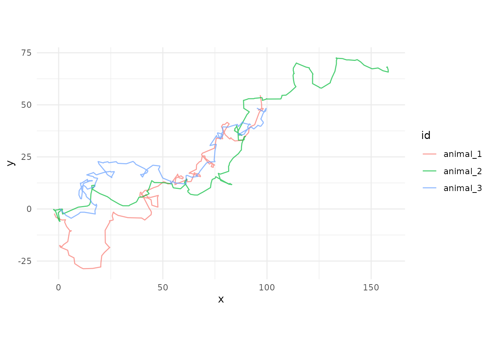
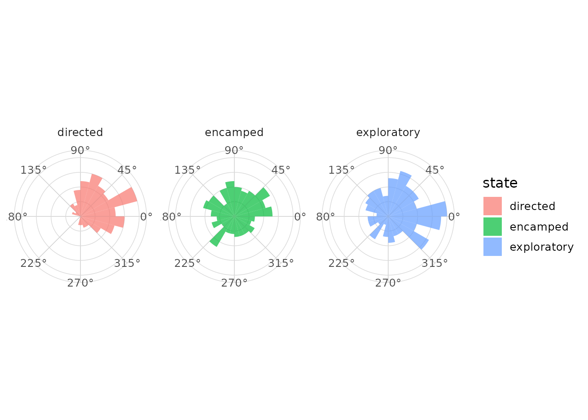
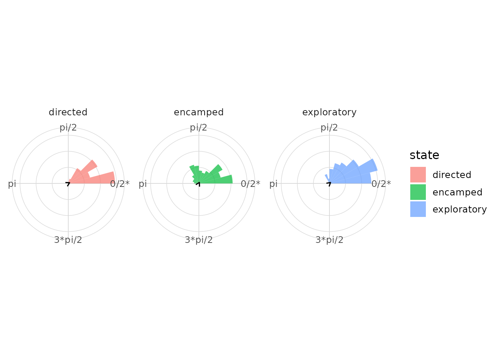

# Visualizing Circular and Directional Data with ggcircular

## Abstract

This demonstration presents a reproducible workflow for simulated animal
movement data. The aim is to show how rose diagrams, circular density
estimates and mean directions can be combined in a `ggplot2` grammar.

## Introduction

Directional variables occur in wind, movement, orientation and
time-of-day data. Their periodic nature requires summaries and graphics
that respect the circle.

## Circular data and specialized graphics

Circular graphics should keep the endpoints of the angular scale
adjacent. They should also distinguish directionality, concentration and
uncertainty.

## The grammar of ggcircular

``` r

library(ggplot2)
library(dplyr)
#> 
#> Attaching package: 'dplyr'
#> The following objects are masked from 'package:stats':
#> 
#>     filter, lag
#> The following objects are masked from 'package:base':
#> 
#>     intersect, setdiff, setequal, union
library(ggcircular)
```

## Simulated trajectories

``` r

ggplot(animal_steps, aes(x = x, y = y, group = id, colour = id)) +
  geom_path(alpha = 0.7) +
  coord_equal() +
  theme_minimal()
```



## Directional features

``` r

movement_summary <- animal_steps |>
  group_by(state) |>
  summarise(
    mean_step = mean(step_length, na.rm = TRUE),
    median_step = median(step_length, na.rm = TRUE),
    .groups = "drop"
  )

movement_summary
#> # A tibble: 3 × 3
#>   state       mean_step median_step
#>   <chr>           <dbl>       <dbl>
#> 1 directed        3.30        3.23 
#> 2 encamped        0.471       0.382
#> 3 exploratory     1.35        1.20
```

## Bearings by state

``` r

ggplot(animal_steps, aes(x = bearing, fill = state)) +
  geom_rose(bins = 24, alpha = 0.7) +
  facet_wrap(~ state) +
  scale_x_circular_degrees() +
  coord_circular() +
  theme_circular()
#> Warning: Removed 3 rows containing non-finite outside the scale range
#> (`stat_rose()`).
```



## Turn angles by state

``` r

ggplot(animal_steps, aes(x = turn_angle, fill = state)) +
  geom_rose(bins = 24, alpha = 0.7) +
  geom_mean_direction() +
  facet_wrap(~ state) +
  scale_x_circular_radians() +
  coord_circular() +
  theme_circular()
#> Warning: Removed 280 rows containing non-finite outside the scale range
#> (`stat_rose()`).
#> Warning: Removed 280 rows containing non-finite outside the scale range
#> (`stat_mean_direction()`).
```



## Mean directions and resultant length

``` r

animal_steps |>
  group_by(state) |>
  circular_summary(turn_angle)
#> # A tibble: 3 × 8
#>   state           n   mean     R  Rbar variance    sd kappa
#>   <chr>       <int>  <dbl> <dbl> <dbl>    <dbl> <dbl> <dbl>
#> 1 directed      153 0.0601 131.  0.856    0.144 0.558 3.78 
#> 2 encamped      207 0.203   57.6 0.278    0.722 1.60  0.579
#> 3 exploratory   234 0.0822 159.  0.679    0.321 0.880 1.88
```

## Circular densities

``` r

ggplot(animal_steps, aes(x = turn_angle, colour = state)) +
  geom_circular_density(linewidth = 1) +
  scale_x_circular_radians() +
  coord_circular() +
  theme_circular()
#> Warning: Removed 280 rows containing non-finite outside the scale range
#> (`stat_circular_density()`).
```


## Interpretation

In the simulated data, directed movement has longer steps and more
concentrated turn angles. Encamped movement has shorter steps and more
diffuse turning. Exploratory movement is intermediate. These statements
describe the simulated dataset and should not be generalized beyond it.

## Discussion

The example shows how the same grammar can summarize raw angular
observations, derived movement quantities and grouped comparisons.

## Reproducibility

All data used here are included in the package as simulated datasets.
The code chunks can be evaluated after installing `ggcircular`.
