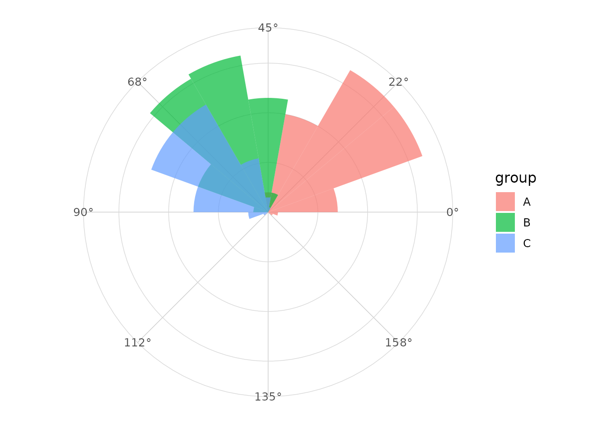
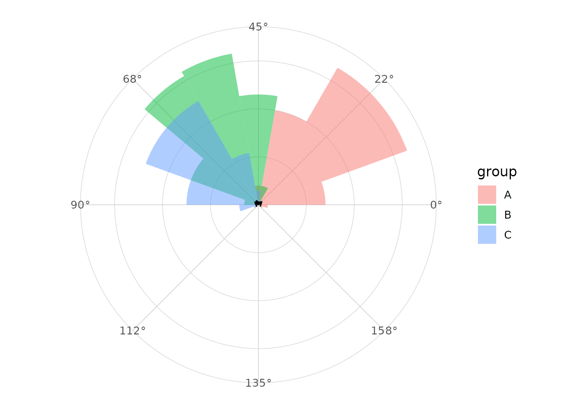
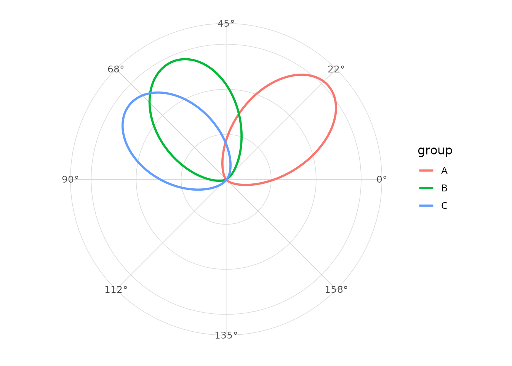

# Axial data

## Directional versus axial

Directional observations have a head and tail. Axial observations
represent an orientation where angles separated by `pi` are equivalent.

## Examples

Fiber orientations, fault orientations and undirected line segments are
common examples of axial data.

## Doubling angles

The usual computational approach doubles angles, applies directional
circular statistics, then halves the resulting mean direction.

``` r

library(ggplot2)
library(ggcircular)

circular_summary(axial_orientations, orientation, axial = TRUE)
#> # A tibble: 1 × 7
#>       n  mean     R  Rbar variance    sd kappa
#>   <int> <dbl> <dbl> <dbl>    <dbl> <dbl> <dbl>
#> 1   300 0.865  206. 0.688    0.312 0.864  1.94
```

## Axial rose diagram

``` r

ggplot(axial_orientations, aes(x = orientation, fill = group)) +
  geom_rose(bins = 18, axial = TRUE, alpha = 0.7) +
  scale_x_circular_degrees(limits = c(0, pi)) +
  coord_circular() +
  theme_circular()
```



## Axial mean

``` r

ggplot(axial_orientations, aes(x = orientation, fill = group)) +
  geom_rose(bins = 18, axial = TRUE, alpha = 0.5) +
  geom_mean_direction(axial = TRUE) +
  scale_x_circular_degrees(limits = c(0, pi)) +
  coord_circular() +
  theme_circular()
```



## Axial density

``` r

ggplot(axial_orientations, aes(x = orientation, colour = group)) +
  geom_circular_density(axial = TRUE, linewidth = 1) +
  scale_x_circular_degrees(limits = c(0, pi)) +
  coord_circular() +
  theme_circular()
```



## Communication

Reports should state clearly whether angles are directional or axial,
because the interpretation of the same numeric angle can change.
