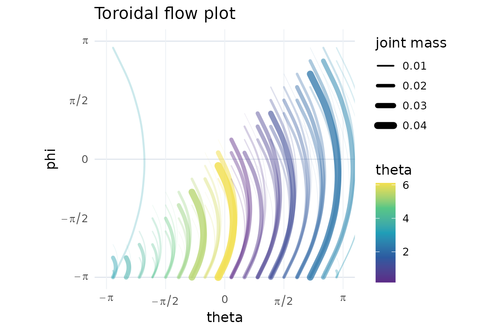
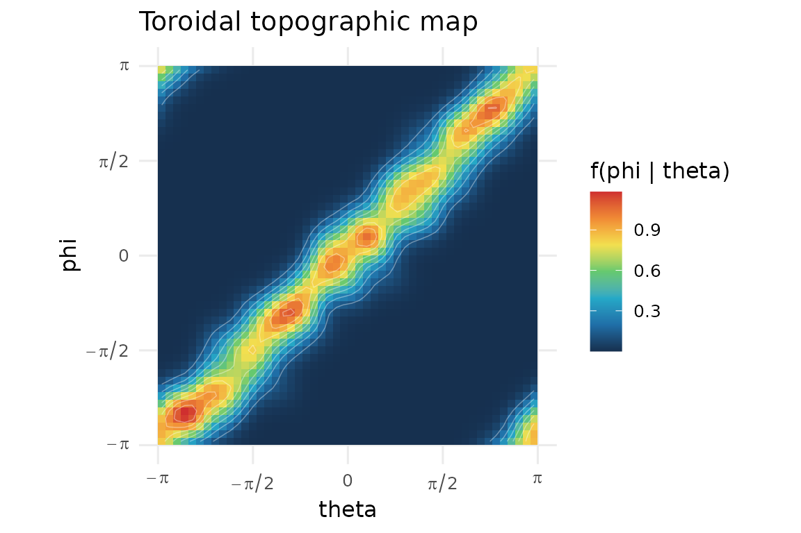
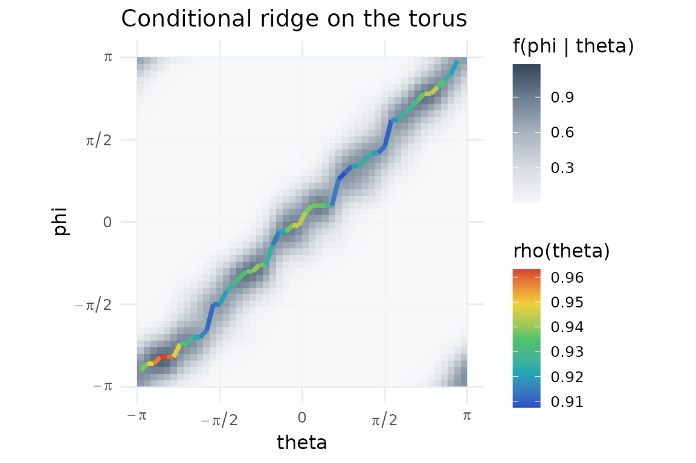
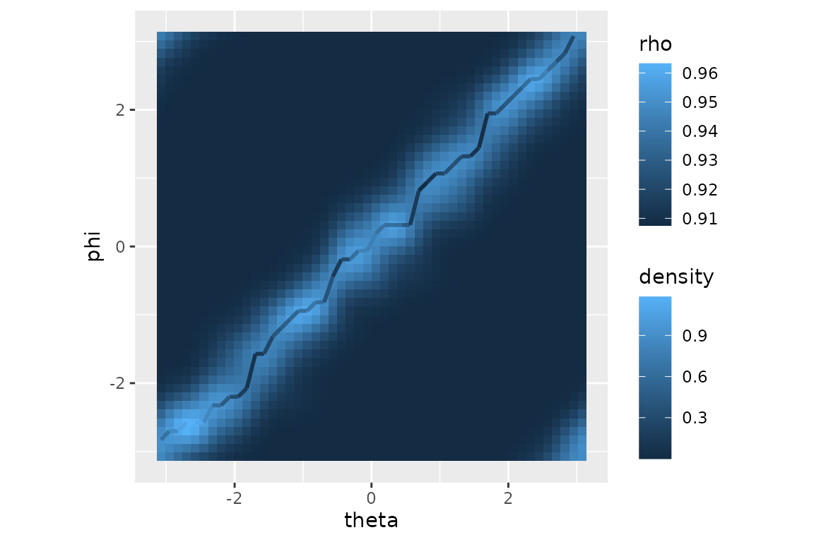

# Circular-circular workflow

This vignette shows a basic circular-circular workflow. Both variables
are angles, so the sample space is a torus.

``` r

library(ggplot2)
library(ggcircular)

dat <- simulate_tor_diagnostic(
  n = 260,
  scenario = "diagonal",
  seed = 2
)
```

The toroidal flow displays conditional binned mass between angular
sectors. The toroidal topography estimates `f(phi | theta)`. The
conditional ridge extracts a dominant modal relation.

``` r

plot_toroidal_flow(dat$theta, dat$phi, n_sectors = 18)
```



``` r

plot_toroidal_topography(dat$theta, dat$phi, n_theta = 50, n_phi = 50, conditional = TRUE)
```



``` r

plot_toroidal_ridge(dat$theta, dat$phi, n_theta = 50, n_phi = 50)
```



The ridge keeps the first exact grid maximum for reproducibility and
backward compatibility. It also reports whether distinct local modes are
nearly tied.

``` r

ridge <- toroidal_ridge_data(
  dat$theta,
  dat$phi,
  n_theta = 50,
  n_phi = 50,
  tie_tolerance = 0.01
)

table(ridge$ridge_ambiguous)
#> 
#> FALSE 
#>    50
```

The same displays can be built as `ggplot2` layers.

``` r

ggplot(dat, aes(x = theta, y = phi)) +
  stat_toroidal_topography(n_theta = 50, n_phi = 50, conditional = TRUE) +
  stat_toroidal_ridge(n_theta = 50, n_phi = 50, linewidth = 1) +
  coord_equal()
```



Exact ties select the first grid maximum. Near-ties are flagged when the
ratio of the second-highest distinct local maximum to the highest local
maximum is at least `1 - tie_tolerance`. The selected curve is
deterministic, but it is not stable under symmetric, multimodal or
near-tied conditional densities. In those cases, use the topography as
the primary display and do not interpret a single ridge in isolation.
