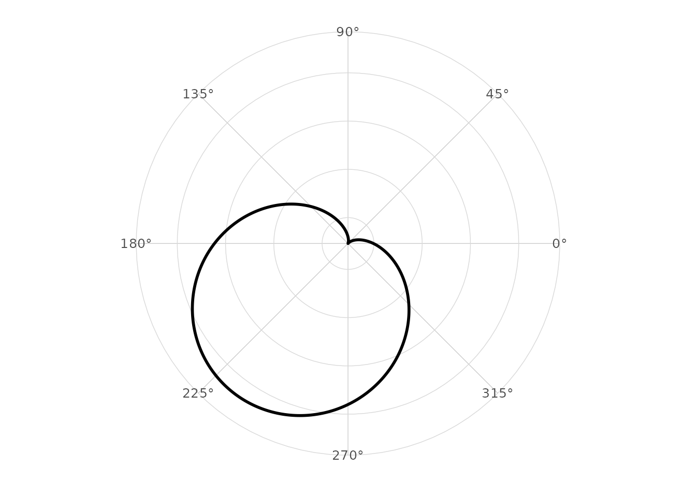
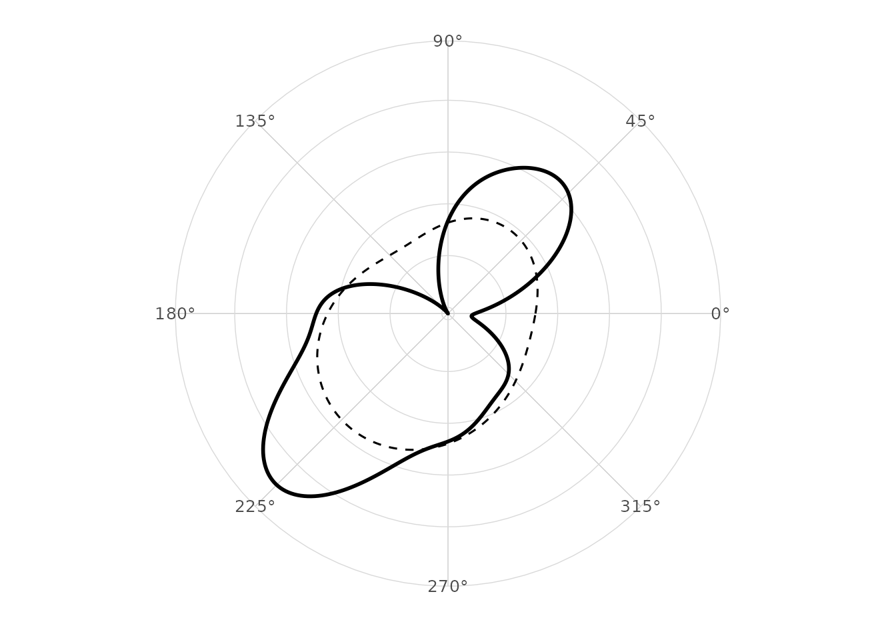
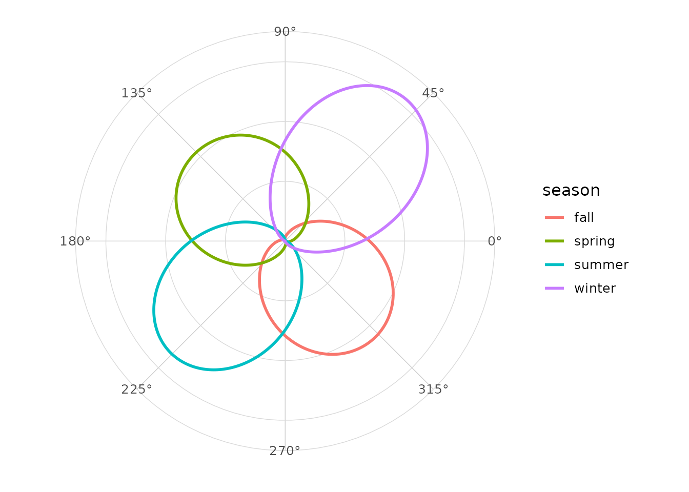
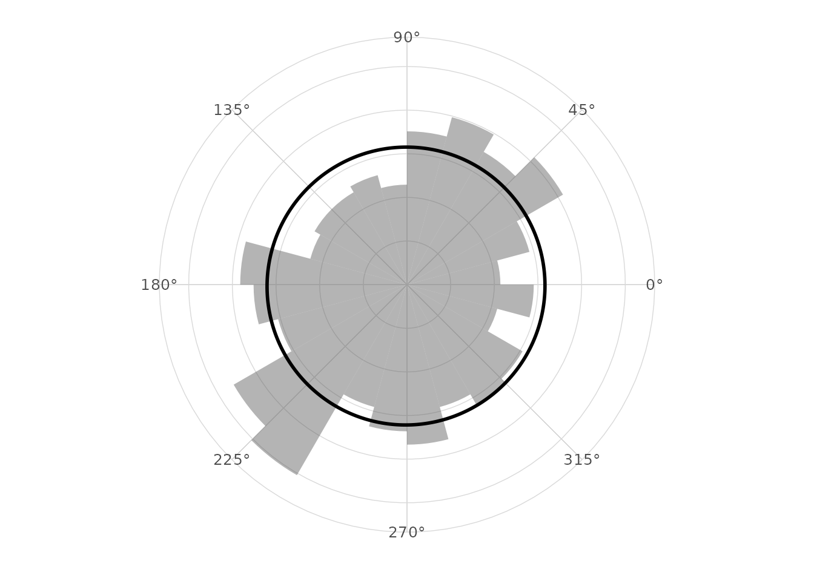
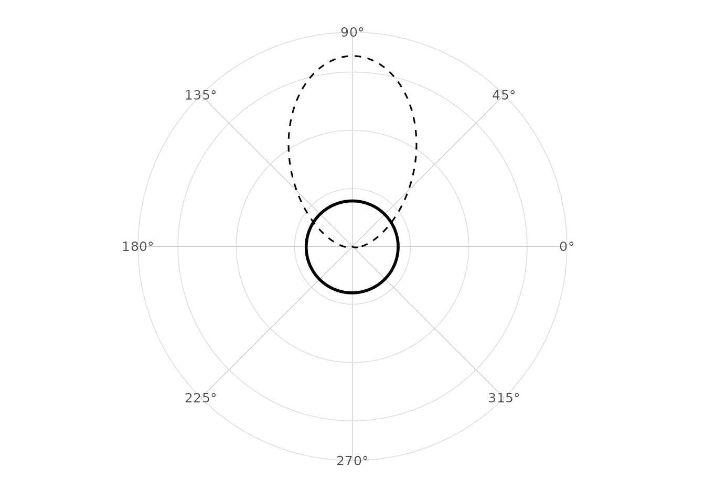

# Circular density estimation

## Density on a circle

A circular density integrates to one over the angular period. For
directional data the period is `2 * pi`; for axial data the period is
`pi`.

## Boundary at 0 and 2 pi

Linear kernel density estimates treat the endpoints as far apart.
Circular kernels wrap around the boundary.

## Von Mises kernel

[`stat_circular_density()`](https://aureliennicosiaulaval.github.io/ggcircular/reference/stat_circular_density.md)
uses a von Mises kernel,
`exp(kappa * cos(theta - mu)) / (2 * pi * I0(kappa))`, where `I0` is the
modified Bessel function of order zero.

``` r

library(ggplot2)
library(ggcircular)

ggplot(wind_directions, aes(x = direction)) +
  geom_circular_density(linewidth = 1) +
  scale_x_circular_degrees() +
  coord_circular() +
  theme_circular()
```



## Bandwidth and concentration

The `bw` argument is interpreted as `1 / sqrt(kappa)`. Smaller
bandwidths produce more concentrated kernels.

``` r

ggplot(wind_directions, aes(x = direction)) +
  geom_circular_density(bw = 0.3, linewidth = 1) +
  geom_circular_density(bw = 0.8, linetype = 2) +
  scale_x_circular_degrees() +
  coord_circular() +
  theme_circular()
```



## Comparing groups

``` r

ggplot(wind_directions, aes(x = direction, colour = season)) +
  geom_circular_density(linewidth = 1) +
  scale_x_circular_degrees() +
  coord_circular() +
  theme_circular()
```



## Rose diagram overlay

``` r

ggplot(wind_directions, aes(x = direction)) +
  geom_rose(aes(y = after_stat(density)), bins = 24, alpha = 0.45) +
  geom_circular_density(linewidth = 1) +
  scale_x_circular_degrees() +
  coord_circular() +
  theme_circular()
```



## Empirical and theoretical density

``` r

ggplot(wind_directions, aes(x = direction)) +
  geom_circular_density(linewidth = 1) +
  stat_vonmises(mu = pi / 2, kappa = 3, linetype = 2) +
  scale_x_circular_degrees() +
  coord_circular() +
  theme_circular()
```


