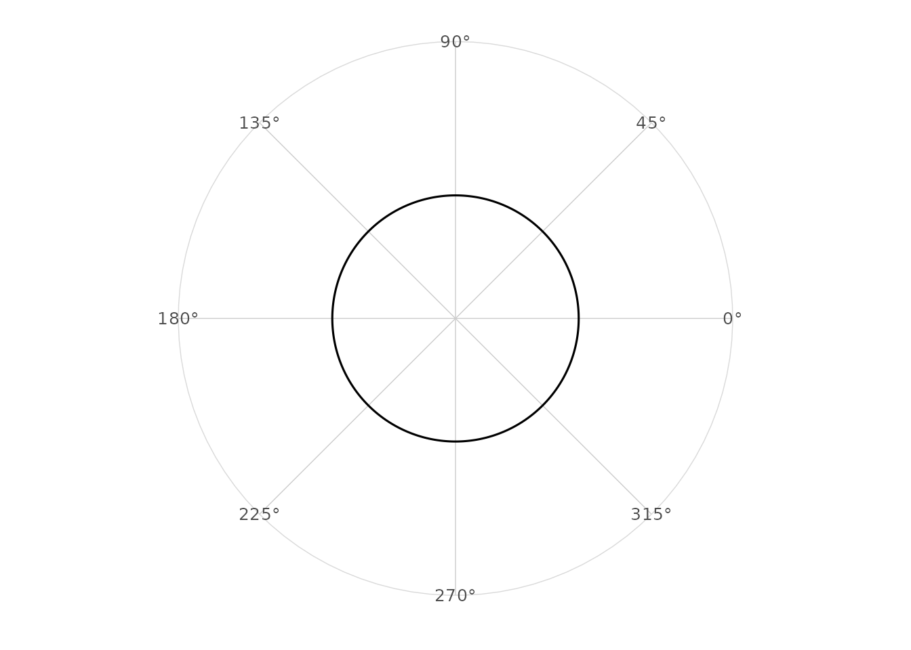
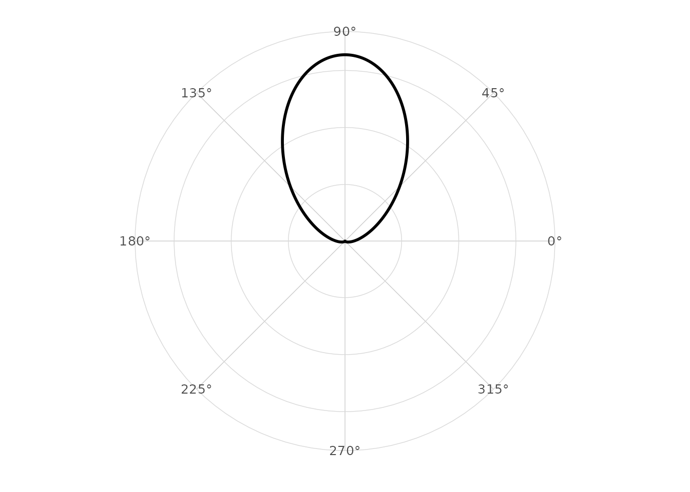
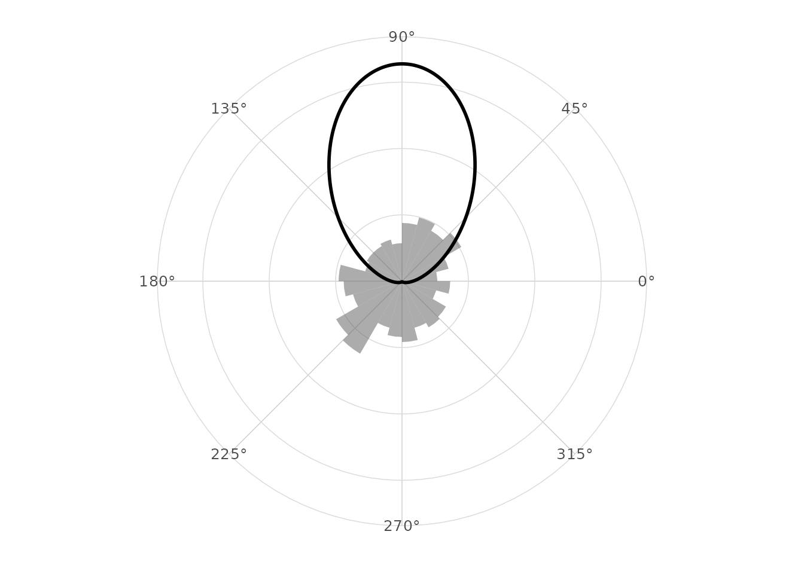
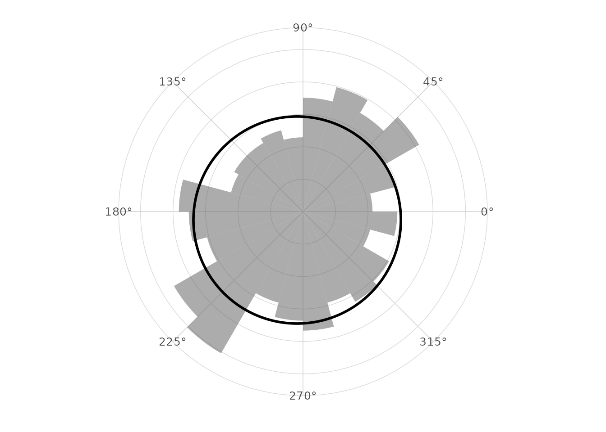

# Circular distributions

## Uniform circular distribution

The circular uniform density is constant over the angular period.

``` r

library(ggplot2)
library(ggcircular)

ggplot() +
  stat_uniform_circular() +
  scale_x_circular_degrees() +
  coord_circular() +
  theme_circular()
```



## Von Mises distribution

The von Mises distribution is a common circular analogue of a unimodal
normal model. The parameter `mu` controls the mean direction and `kappa`
controls concentration.

``` r

ggplot() +
  stat_vonmises(mu = pi / 2, kappa = 3, linewidth = 1) +
  scale_x_circular_degrees() +
  coord_circular() +
  theme_circular()
```



## Overlay a theoretical density

``` r

ggplot(wind_directions, aes(x = direction)) +
  geom_rose(aes(y = after_stat(density)), bins = 24, alpha = 0.5) +
  stat_vonmises(mu = pi / 2, kappa = 3, linewidth = 1) +
  scale_x_circular_degrees() +
  coord_circular() +
  theme_circular()
```



## Simple fitted von Mises density

``` r

ggplot(wind_directions, aes(x = direction)) +
  geom_rose(aes(y = after_stat(density)), bins = 24, alpha = 0.5) +
  stat_vonmises_fit(linewidth = 1) +
  scale_x_circular_degrees() +
  coord_circular() +
  theme_circular()
```



## Empirical and theoretical comparison

The fitted density is a descriptive approximation. It is useful as a
visual reference and should not replace formal model checking when a
parametric model is used for inference.
