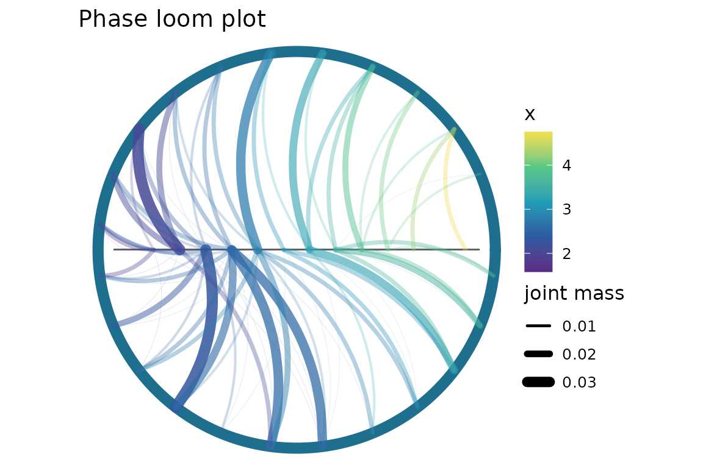
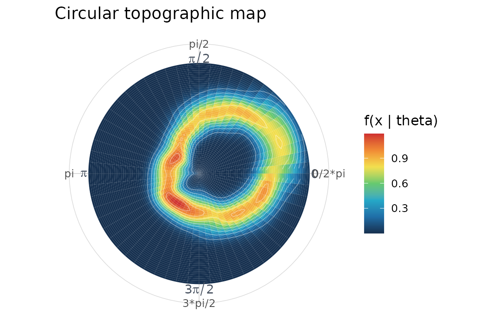
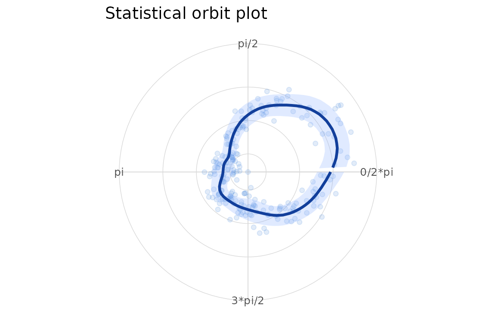
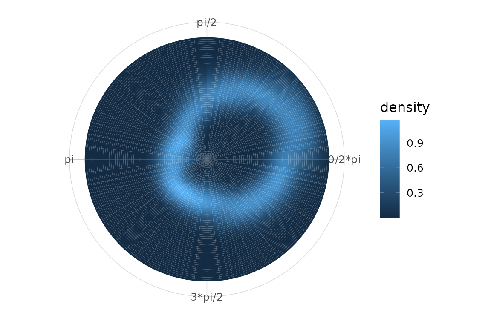
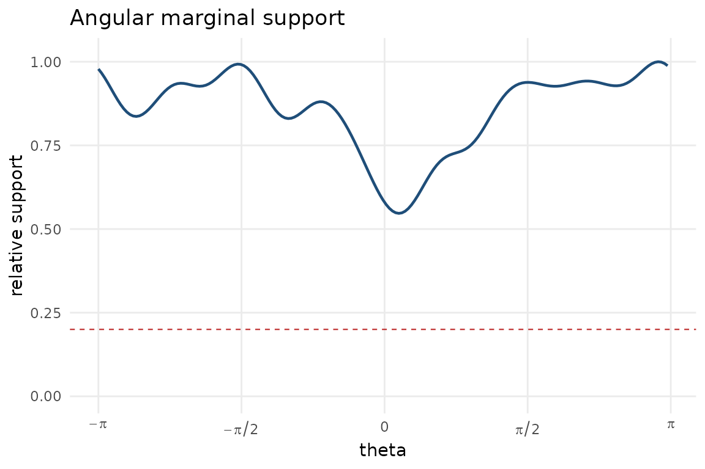

# Circular-linear workflow

This vignette shows a basic circular-linear workflow. The conditioning
variable is an angle and the response is real-valued, so the sample
space is a cylinder.

``` r

library(ggplot2)
library(ggcircular)

dat <- simulate_cyl_diagnostic(
  n = 220,
  scenario = "smooth",
  seed = 1
)
```

The phase loom displays conditional binned mass. The circular topography
estimates a conditional density. The statistical orbit summarizes the
local conditional mean and spread.

``` r

plot_phase_loom(dat$theta, dat$x, n_sectors = 24, n_x_bins = 14, max_flows = 80)
#> Warning in ggplot2::geom_segment(ggplot2::aes(x = -0.92, y = 0, xend = 0.92, : All aesthetics have length 1, but the data has 220 rows.
#> ℹ Please consider using `annotate()` or provide this layer with data containing
#>   a single row.
```



``` r

plot_circular_topography(dat$theta, dat$x, n_theta = 60, n_x = 60)
```



``` r

plot_stat_orbit(dat$theta, dat$x, n_theta = 60)
```



The same topography is available as a `ggplot2` statistical layer.

``` r

ggplot(dat, aes(x = theta, y = x)) +
  stat_circular_topography(n_theta = 60, n_x = 60, kappa = 14) +
  coord_circular() +
  scale_x_circular_radians() +
  theme_circular()
```



For interpretation, pair conditional displays with a support diagnostic.

``` r

plot_marginal_support(dat$theta, kappa = 14, relative_threshold = 0.20)
```


