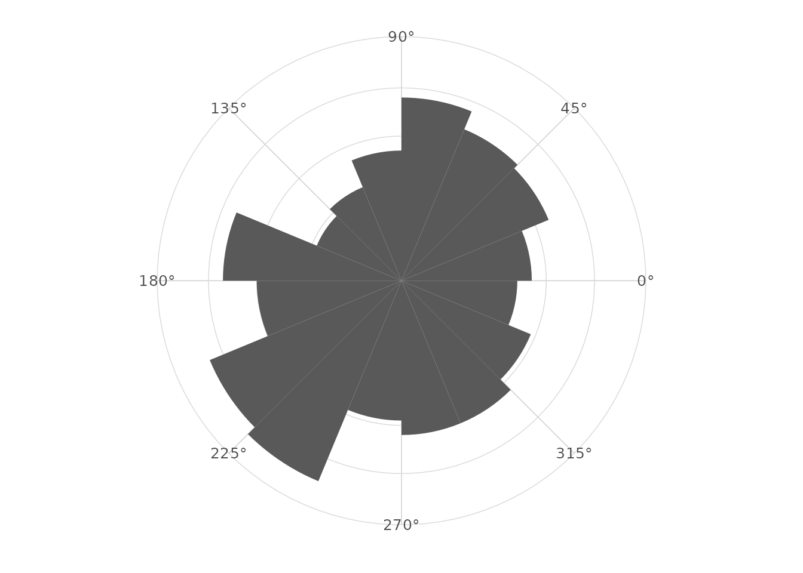
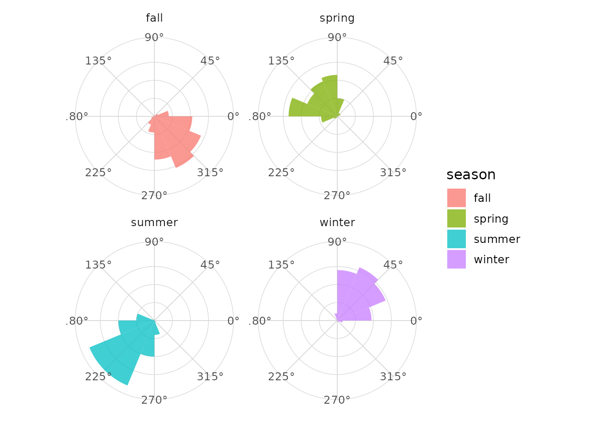
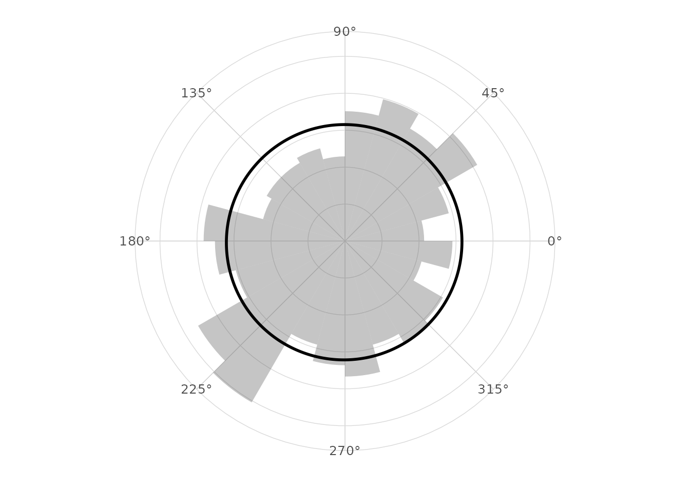
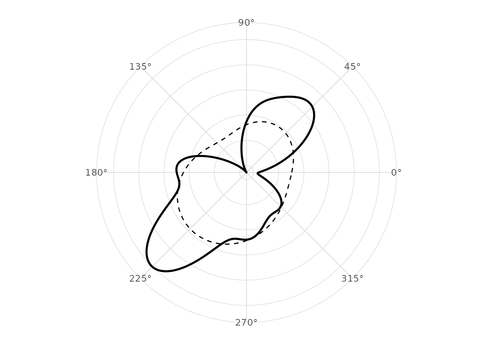
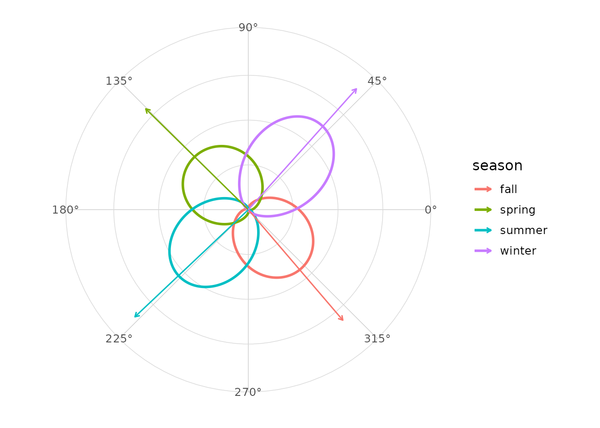
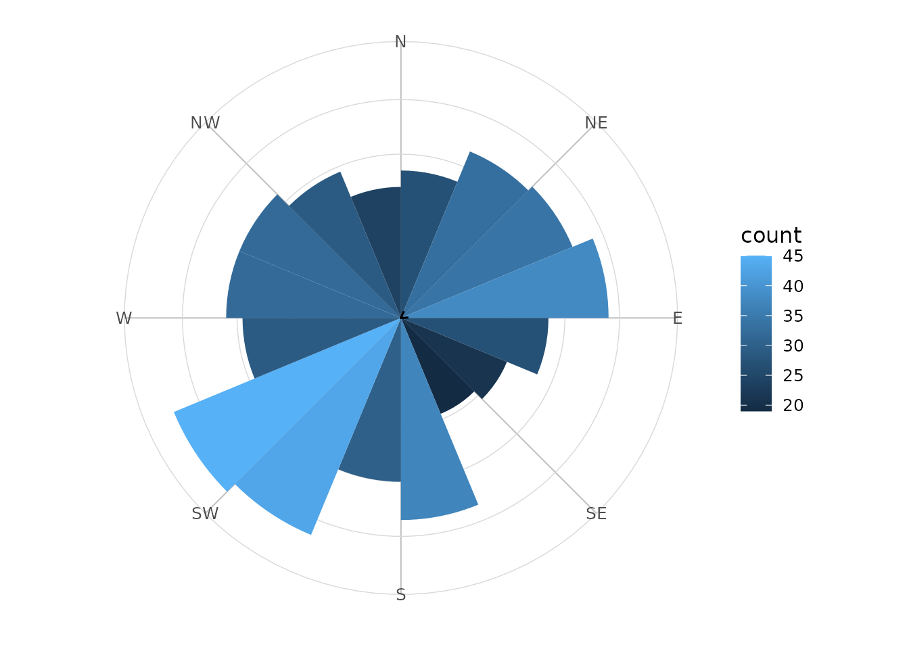
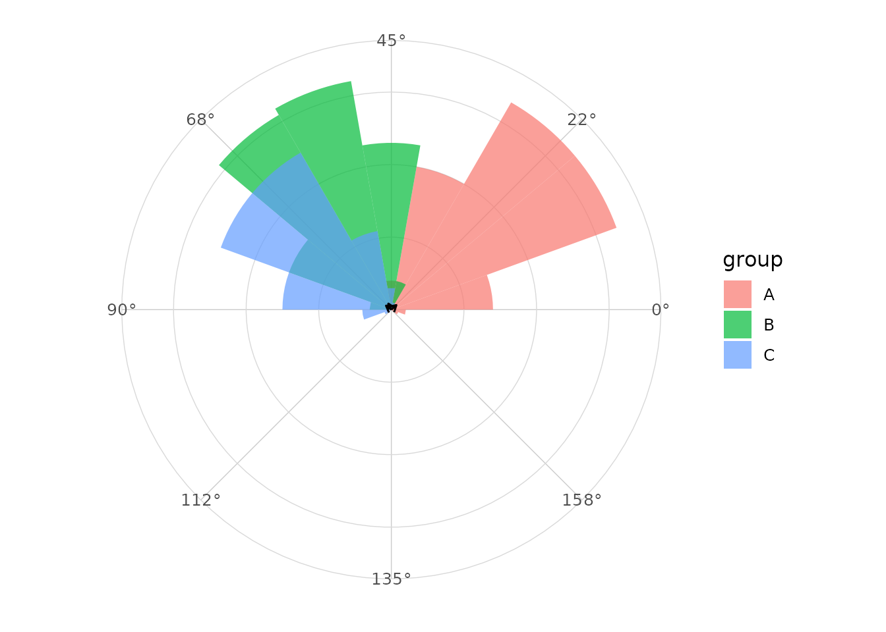
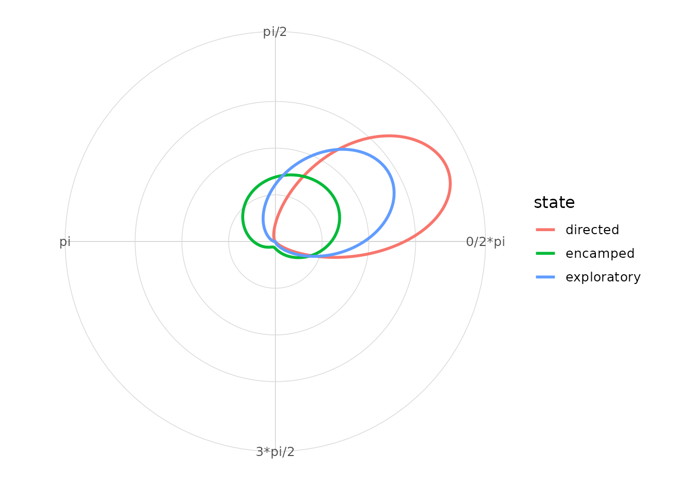
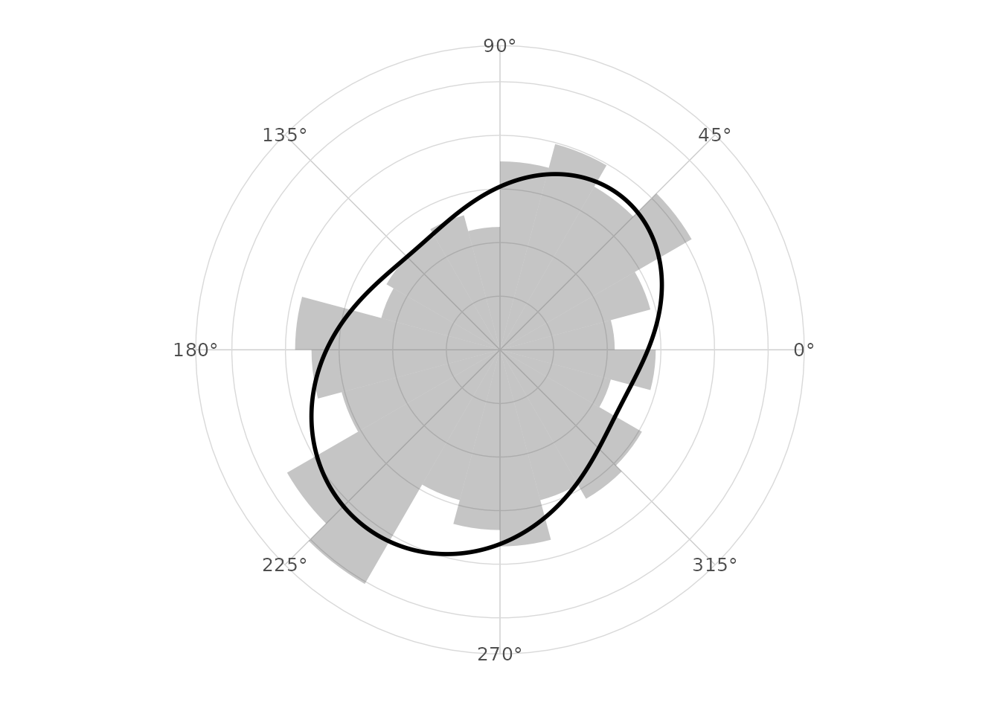
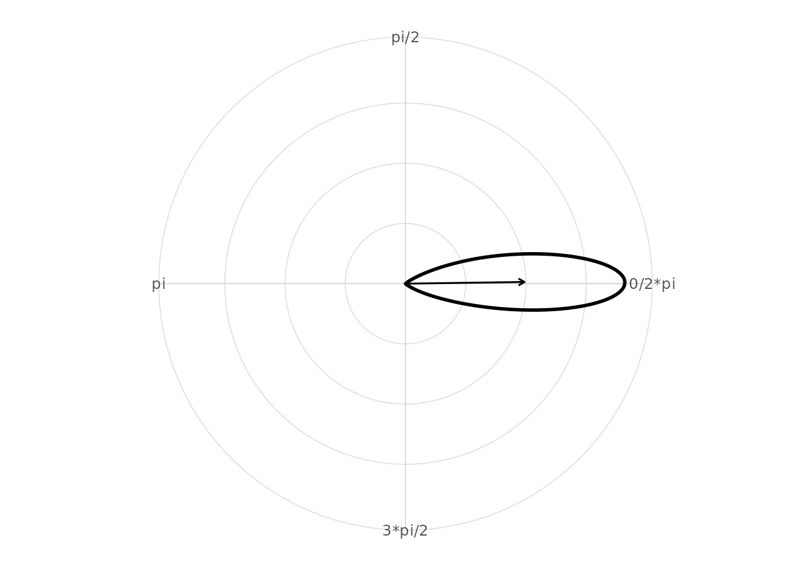

# Getting started with ggcircular

## Overview

`ggcircular` extends `ggplot2` for circular, axial and directional data.
This vignette gives a complete first tour of the package: angle
conventions, rose diagrams, circular densities, mean directions,
uncertainty, axial data, movement data, mixtures of von Mises
distributions and model diagnostics.

## Installation

CRAN currently provides version 0.1.0. Install version 0.2.0 from its
tagged GitHub release with
`remotes::install_github("AurelienNicosiaULaval/ggcircular@v0.2.0")`.

``` r

library(ggplot2)
library(dplyr)
#> 
#> Attaching package: 'dplyr'
#> The following objects are masked from 'package:stats':
#> 
#>     filter, lag
#> The following objects are masked from 'package:base':
#> 
#>     intersect, setdiff, setequal, union
library(ggcircular)
```

## Why circular data are different

Circular observations live on a periodic scale. In radians, `0` and
`2 * pi` represent the same direction. This means that linear tools can
fail near the boundary.

``` r

boundary_angles <- tibble(
  theta = c(0.05, 0.10, 2 * pi - 0.10, 2 * pi - 0.05)
)

boundary_angles |>
  summarise(
    arithmetic_mean = mean(theta),
    circular_mean = mean_direction(theta),
    Rbar = mean_resultant_length(theta)
  )
#> # A tibble: 1 × 3
#>   arithmetic_mean circular_mean  Rbar
#>             <dbl>         <dbl> <dbl>
#> 1            3.14             0 0.997
```

The arithmetic mean is near `pi`, even though the observations are
concentrated near zero. The circular mean uses sine and cosine
components, so it respects the periodic scale.

## Data included in the package

The package ships with four simulated datasets. They are small enough
for examples and large enough to show realistic grouped workflows.

``` r

glimpse(wind_directions)
#> Rows: 500
#> Columns: 4
#> $ station   <chr> "station_C", "station_B", "station_B", "station_B", "station…
#> $ direction <dbl> 3.61399414, 0.51640381, 3.18127144, 2.81398312, 3.48203785, …
#> $ speed     <dbl> 8.344303, 21.651462, 18.502725, 17.959547, 14.707662, 23.812…
#> $ season    <chr> "summer", "winter", "summer", "spring", "summer", "winter", …
glimpse(animal_steps)
#> Rows: 600
#> Columns: 8
#> $ id          <chr> "animal_1", "animal_1", "animal_1", "animal_1", "animal_1"…
#> $ time        <int> 1, 2, 3, 4, 5, 6, 7, 8, 9, 10, 11, 12, 13, 14, 15, 16, 17,…
#> $ x           <dbl> -2.0936857, -1.2574724, 1.3703509, 1.8277511, 3.1477115, 3…
#> $ y           <dbl> -2.206504, -4.007244, -5.236538, -5.303458, -5.208255, -5.…
#> $ step_length <dbl> NA, 1.9854255, 2.9011413, 0.4622696, 1.3233892, 0.1811402,…
#> $ bearing     <dbl> NA, 5.14713037, 5.84562829, 6.13791093, 0.07200064, 0.1664…
#> $ turn_angle  <dbl> NA, NA, 0.69849792, 0.29228264, 0.21727502, 0.09441297, -2…
#> $ state       <chr> "exploratory", "directed", "exploratory", "encamped", "dir…
glimpse(hourly_activity)
#> Rows: 240
#> Columns: 5
#> $ id       <chr> "id_1", "id_1", "id_1", "id_1", "id_1", "id_1", "id_1", "id_1…
#> $ hour     <int> 0, 1, 2, 3, 4, 5, 6, 7, 8, 9, 10, 11, 12, 13, 14, 15, 16, 17,…
#> $ angle    <dbl> 0.0000000, 0.2617994, 0.5235988, 0.7853982, 1.0471976, 1.3089…
#> $ activity <dbl> 0.7068110, 0.9307937, 0.8454886, 1.1279882, 1.2763149, 1.8896…
#> $ group    <chr> "control", "control", "control", "control", "control", "contr…
glimpse(axial_orientations)
#> Rows: 300
#> Columns: 3
#> $ sample      <chr> "sample_4", "sample_9", "sample_1", "sample_3", "sample_7"…
#> $ orientation <dbl> 0.33720049, 1.29682693, 0.90355276, 1.08422434, 1.01917603…
#> $ group       <chr> "A", "C", "B", "C", "C", "C", "B", "C", "A", "A", "B", "A"…
```

``` r

wind_directions |>
  count(season, station)
#> # A tibble: 16 × 3
#>    season station       n
#>    <chr>  <chr>     <int>
#>  1 fall   station_A    40
#>  2 fall   station_B    31
#>  3 fall   station_C    27
#>  4 fall   station_D    33
#>  5 spring station_A    32
#>  6 spring station_B    26
#>  7 spring station_C    31
#>  8 spring station_D    26
#>  9 summer station_A    21
#> 10 summer station_B    36
#> 11 summer station_C    42
#> 12 summer station_D    39
#> 13 winter station_A    17
#> 14 winter station_B    33
#> 15 winter station_C    27
#> 16 winter station_D    39
```

## Directional versus axial data

Directional data have an arrow. For example, a bearing of north and a
bearing of south are different directions. Axial data have an
orientation but no arrow, so an angle and the angle plus `pi` are
equivalent.

``` r

directional <- c(0, pi)
axial <- c(0, pi)

tibble(
  case = c("directional", "axial"),
  Rbar = c(
    mean_resultant_length(directional),
    mean_resultant_length(axial, axial = TRUE)
  ),
  mean = c(
    mean_direction(directional),
    mean_direction(axial, axial = TRUE)
  )
)
#> # A tibble: 2 × 3
#>   case            Rbar  mean
#>   <chr>          <dbl> <dbl>
#> 1 directional 6.12e-17    NA
#> 2 axial       1   e+ 0     0
```

For axial calculations, `ggcircular` doubles the angles internally,
computes the directional statistic, then transforms the answer back to
the original scale.

## Conventions for directions and bearings

The internal default unit is radians. Helpers are provided for degrees,
hours and compass labels.

``` r

tibble(
  degrees = c(0, 90, 180, 270),
  radians = deg_to_rad(degrees),
  hours = rad_to_hour(radians),
  compass = rad_to_compass(radians)
)
#> # A tibble: 4 × 4
#>   degrees radians hours compass
#>     <dbl>   <dbl> <dbl> <chr>  
#> 1       0    0        0 N      
#> 2      90    1.57     6 E      
#> 3     180    3.14    12 S      
#> 4     270    4.71    18 W
```

Compass labels use the bearing convention: zero points north and angles
increase clockwise. Use this with
`coord_circular(zero = "north", direction = "clockwise")`.

For mathematical plots, the default coordinate convention is zero at
east and positive angles rotating counterclockwise. For axial data, set
`axial = TRUE` because `theta` and `theta + pi` represent the same
orientation.

## First rose diagram

A rose diagram is a circular histogram. The first and last bins are
adjacent on the circle.

``` r

ggplot(wind_directions, aes(x = direction)) +
  geom_rose(bins = 16) +
  scale_x_circular_degrees() +
  coord_circular() +
  theme_circular()
```



## Counts, densities and proportions

[`geom_rose()`](https://aureliennicosiaulaval.github.io/ggcircular/reference/geom_rose.md)
exposes computed variables such as `count`, `density` and `proportion`.
These are available with
[`after_stat()`](https://ggplot2.tidyverse.org/reference/aes_eval.html).

``` r

ggplot(wind_directions, aes(x = direction)) +
  geom_rose(
    aes(fill = after_stat(proportion)),
    bins = 16,
    normalize = "proportion"
  ) +
  scale_x_circular_degrees() +
  coord_circular() +
  theme_rose()
```


## Groups and facets

Because the layers follow the `ggplot2` grammar, standard grouping,
colouring and faceting workflows work naturally.

``` r

ggplot(wind_directions, aes(x = direction, fill = season)) +
  geom_rose(bins = 16, alpha = 0.75) +
  facet_wrap(~ season) +
  scale_x_circular_degrees() +
  coord_circular() +
  theme_circular()
```



## Circular density

[`geom_circular_density()`](https://aureliennicosiaulaval.github.io/ggcircular/reference/geom_circular_density.md)
estimates a smooth density on the circle using a von Mises kernel. The
estimate wraps around the origin.

``` r

ggplot(wind_directions, aes(x = direction)) +
  geom_rose(aes(y = after_stat(density)), bins = 24, alpha = 0.35) +
  geom_circular_density(linewidth = 1) +
  scale_x_circular_degrees() +
  coord_circular() +
  theme_circular()
```



The bandwidth can be adjusted. Smaller values show more local variation.

``` r

ggplot(wind_directions, aes(x = direction)) +
  geom_circular_density(bw = 0.25, linewidth = 1) +
  geom_circular_density(bw = 0.75, linetype = 2) +
  scale_x_circular_degrees() +
  coord_circular() +
  theme_circular()
```



## Mean direction and resultant length

The mean resultant length `Rbar` measures concentration. Values close to
one indicate strong concentration; values close to zero indicate weak or
cancelling directionality.

``` r

wind_directions |>
  group_by(season) |>
  circular_summary(direction)
#> # A tibble: 4 × 8
#>   season     n  mean     R  Rbar variance    sd kappa
#>   <chr>  <int> <dbl> <dbl> <dbl>    <dbl> <dbl> <dbl>
#> 1 fall     131 5.42  106.  0.811   0.189  0.647  3.00
#> 2 spring   115 2.36   92.3 0.802   0.198  0.664  2.89
#> 3 summer   138 3.90  120.  0.870   0.130  0.528  4.15
#> 4 winter   116 0.842 105.  0.904   0.0956 0.448  5.52
```

``` r

ggplot(wind_directions, aes(x = direction, colour = season)) +
  geom_circular_density(linewidth = 1) +
  geom_mean_direction(length = "resultant") +
  scale_x_circular_degrees() +
  coord_circular() +
  theme_circular()
```



## Uncertainty and circular tests

[`circular_mean_ci()`](https://aureliennicosiaulaval.github.io/ggcircular/reference/circular_mean_ci.md)
computes large-sample or bootstrap intervals for the mean direction.
[`rayleigh_test()`](https://aureliennicosiaulaval.github.io/ggcircular/reference/rayleigh_test.md)
provides a basic test against circular uniformity.

``` r

circular_mean_ci(wind_directions$direction, method = "large_sample")
#> # A tibble: 1 × 7
#>    mean lower upper level method           n   Rbar
#>   <dbl> <dbl> <dbl> <dbl> <chr>        <int>  <dbl>
#> 1  4.10  3.72  4.49  0.95 large_sample   500 0.0494
rayleigh_test(wind_directions$direction)
#> 
#>  Rayleigh test of circular uniformity
#> 
#> data:  c(3.61399414214871, 0.516403808686312, 3.18127143608671, 2.81398312066174, 3.48203785207672, 0.56424680709192, 0.629856683201911, 5.13158541730147, 0.857734675514404, 5.52884932182807, 6.14565025509431, 3.39186111855533, 5.68072279739308, 4.61418407964105, 4.74543931715619, 0.561767051885953, 3.93703683208835, 4.27621516412755, 0.88537547466561, 3.38244973375004, 4.54086340127989, 0.0252624877997549, 4.27062854516948, 3.97637694706441, 5.85083657554049, 5.87445936548537, 1.58836065931894, 3.77285531449948, 2.84978104987197, 3.65012027729075, 5.46563648989713, 4.10415613798566, 3.75388329273006, 3.98584710606474, 2.82144437086184, 1.50629832290545, 2.18486780537149, 1.55751051364113, 0.0276964845286848, 1.50071871494719, 5.4254641199483, 0.543084919785049, 3.16092065452067, 5.19124427895539, 6.19464201355272, 1.95365834413386, 1.75825901233488, 1.52372125275916, 1.30632888111883, 0.592208207194502, 2.48457594188947, 4.31585345061938, 3.2081127490451, 0.491798377205358, 2.10165361682883, 5.06620154208669, 0.663659415378715, 3.8895585724636, 3.91314585258669, 1.06943034646083, 3.70329020667088, 2.88997331413771, 1.25949333727748, 1.10349295627909, 5.48850298910456, 1.47392385975173, 1.53744771382702, 3.27633450940558, 6.02390363373308, 6.04815804577962, 2.26952313373199, 2.90608819205143, 3.86241193458018, 5.67412084741953, 3.26452859880416, 6.15350006888704, 5.48688255166703, 6.20791616467307, 3.68384365075044, 0.171424413263971, 1.22289990351848, 0.753079742018805, 5.13935788342828, 2.45542670127482, 0.745611903805254, 2.90938404806413, 2.74702586427139, 2.9514284893538, 2.27968831808027, 4.21823280781812, 4.30722391611882, 4.35748350312151, 5.65527822664119, 2.58867423785994, 3.13349236913869, 4.92601382435363, 1.3803664201544, 3.98074646585331, 0.241589583703272, 2.89416586974954, 4.78777809195007, 4.83810271328066, 1.79223368965479, 0.511613556058242, 4.3573339243357, 5.28646241936886, 0.527295585374115, 1.18807009034664, 5.83711134904222, 1.36989616319516, 2.87273782201903, 0.915014496611803, 2.32383561388706, 1.07966269956572, 4.01434607511189, 0.78462043869988, 5.46885293945382, 2.0118951346537, 5.55594286546511, 5.12698629884893, 1.19399119318522, 4.6409638519865, 0.372762827035868, 1.45477015543137, 6.1665437109926, 1.28558438743651, 3.84557068529067, 1.52635330490985, 3.07239368846469, 6.11836229228667, 5.51099187302794, 3.93918610415792, 3.56348178691564, 4.49677867159495, 3.85603721315972, 5.27373647197434, 4.48989903834052, 3.95919733894795, 3.6631658843697, 3.91174484376691, 2.23336435474006, 4.66503636345594, 5.69533325146029, 4.18078449624687, 1.17748434276607, 4.51542532015402, 1.38092818189996, 3.95863852463007, 4.86465650655373, 0.600031048441578, 5.64903433508069, 1.49945938128569, 1.13458378165887, 0.318720239109591, 0.937741030581609, 5.12272810621474, 2.69642747561964, 4.01835946823438, 0.821530057207844, 1.95574045975733, 0.952019577721132, 0.128785533480376, 1.93701079091507, 0.622326941415605, 3.81490338273784, 5.83318150760357, 4.80788354300373, 0.883680527329103, 2.03227696333366, 4.97480147885834, 2.53652203973757, 1.74609782105209, 5.31644410247321, 0.903501240888298, 1.40581408618352, 3.21798275606962, 3.4557590373251, 2.95845594631303, 1.24035058000518, 3.87818094178941, 4.06566783092223, 0.343587710646396, 1.64113506597964, 0.678143008925494, 3.10340916394715, 2.5234856281277, 4.076998724402, 0.227939389240854, 3.75293327615498, 0.745681375843156, 1.79773893567552, 4.64801929729362, 1.94577117034086, 2.5558571758186, 2.39320922469584, 4.93891730713478, 2.32486289997962, 1.63037333578965, 3.31520453696742, 5.30841845365601, 0.372030516182691, 2.78085103499691, 2.40916313762562, 2.76513836870851, 1.59553887068255, 3.92070775491521, 5.05790011995272, 2.35287611790499, 2.96528228895961, 4.32666169122151, 5.9072978350119, 3.83027765097782, 3.2164940873178, 5.70351195300256, 0.93247661803657, 5.15238639384105, 0.663953990503612, 5.66157231365886, 3.26171462649326, 1.45713601377082, 3.2983967872763, 1.95136053171296, 3.23351222754238, 4.78975722517733, 4.78186452379316, 3.695640374107, 4.8271958451668, 3.46123341534021, 5.57630440902539, 4.26989964224631, 0.350949155615401, 4.85043816877712, 1.43186037992258, 2.9749726389762, 5.84270909645015, 1.05597071241368, 5.45235967630183, 3.84902337434668, 2.17245168749446, 3.04717565556487, 5.84461210176993, 5.36426807769498, 6.09912805998087, 4.96680757207252, 4.05948061120776, 2.07519546021824, 2.84033536028553, 0.168823611299175, 1.70977104893379, 5.92098890272642, 3.26949882414043, 5.23428948002588, 1.69190192004778, 6.19346211529975, 4.49696023320816, 6.19446684610556, 3.7893701417916, 3.49909055641389, 5.40819799265068, 1.8846391290683, 1.21393910596394, 1.21552400584744, 3.6349745442456, 2.4634378399828, 1.95306022103064, 0.676993988570905, 3.93214167937047, 1.54946198744965, 4.36385094219077, 4.20260744900989, 0.82460022269939, 1.96563404453465, 5.47075647306217, 3.49105040587683, 3.32335522684759, 3.33345535109043, 5.84242928774451, 4.31021463398591, 0.830616800713155, 1.87429063250033, 4.63676047700973, 2.98274202524661, 5.32117631336934, 1.87580316931015, 4.14713947391929, 2.90022394794143, 6.02877873150384, 0.877728151162343, 0.766619044785883, 2.5228198449887, 1.18336686064368, 5.32978254102456, 0.480816221958569, 5.26714356331552, 4.43017298701401, 2.97367368861929, 0.741214166998673, 4.01559877502578, 0.305708772610524, 5.35578150769504, 5.67224213603809, 4.72340182475188, 5.10106676375622, 4.93432516183874, 3.54912615605738, 2.467008898568, 0.383693716213354, 4.1778110374832, 5.93580811375246, 2.22148314590711, 0.695143195391176, 2.56660094585538, 3.86451460546857, 4.75595722432728, 1.85086408782989, 2.85188077385315, 1.13650012641987, 1.85183397114663, 0.760046058469871, 4.66854906429729, 4.59375721951795, 5.97713848300698, 4.86285468485826, 2.71991476947419, 2.30715292875096, 0.877103345327341, 2.53242534640893, 4.61919504110127, 1.59021218025985, 2.01634243854563, 6.03532149675354, 3.52272992491007, 6.20511867529189, 2.94036438670711, 4.28094051000119, 6.08817754236178, 4.28050227060493, 3.94257340390048, 2.27807075458384, 0.37966828266774, 1.07007046003566, 3.6314960185085, 3.85761184272218, 0.290280604702401, 5.77985344386501, 5.83270710164554, 1.0174845770154, 2.89615963673962, 1.58107936514707, 5.91740372236149, 0.970114871729027, 1.42482016242241, 6.16857082735071, 2.76323109090468, 1.50286652193992, 2.10460490221135, 5.24362452608994, 3.67674993950874, 4.684245743071, 5.06986407882866, 4.19961987159562, 4.06181456709559, 3.71015031090074, 0.568004519325911, 5.02362397605336, 4.06902374222269, 4.00670250402605, 3.99406586291155, 3.02690407702263, 0.24204898447192, 3.67884707982449, 4.17390245121511, 1.0501552383401, 5.48554177000912, 3.2534035574453, 0.607437218823521, 2.32387054099722, 4.68929088864066, 5.63270291232151, 1.06305238835461, 1.40510154106626, 1.33926684832572, 2.9193216111759, 1.36233590748847, 5.47739489161281, 3.65710105949873, 0.276645059413112, 0.176706690397123, 1.32381779895136, 3.13413908979964, 0.967610140820129, 3.19004724297362, 3.73572342516266, 0.698842921725046, 4.87416618466692, 5.15402319845046, 4.17140260230116, 5.00153849029061, 0.497819145365931, 4.20328951404635, 0.702392839987015, 3.829295278135, 4.73868633902796, 2.99753719488559, 4.05278142217793, 4.67147517252104, 5.06141329630149, 5.54698117956277, 4.11173633921752, 0.165202227483394, 3.91069891339029, 0.383561820290968, 1.55022261592284, 3.25518382541973, 3.84110621092413, 4.56659839277621, 1.08653834341982, 3.04694149757914, 4.48987968990351, 5.11734368389185, 5.66475271719934, 4.17889337704655, 2.85817235346097, 2.6159630514743, 3.03108419307564, 5.54107102563832, 3.53607034711238, 6.26809787788282, 2.31698401678689, 3.74576011697637, 0.864108209209264, 1.5802118303633, 3.6517313682625, 3.36357147943932, 4.58533773954467, 3.19103194878316, 4.03384706710371, 4.76106093475281, 4.81901276141423, 1.23977284481888, 4.12784986364102, 3.56797141334475, 0.896458792049424, 3.70970605097961, 3.54969636829351, 3.2062230604813, 2.77985955675029, 1.22432857910086, 4.93259138319717, 2.46775799862233, 3.0081898503984, 4.46876212802286, 4.57781331054168, 0.552753637975135, 0.324650573480147, 0.728226014527112, 3.93153251949303, 1.21838451558546, 5.20699823430224, 6.24801251078914, 0.239056878808596, 1.02192634247736, 1.85186911144518, 5.62985543179424, 0.816738462684404, 0.8208128687534, 4.79467712783871, 1.22335103227416, 6.15681766244913, 2.18445569446985, 4.02130822642411, 2.57709436969584, 5.71567719459435, 5.55723921768227, 4.36715762912422, 0.00707276489959519, 3.40550301804636, 4.02396304780405, 0.146235683957278, 2.89089615037712, 5.14749594931166, 0.416423364443049, 1.6892383377323, 5.45251947827975, 3.68341682083734, 5.65190756066476, 3.6106115015918, 1.62664317760994, 0.679671124258451, 1.25048140461135, 0.325155400571825, 3.29802486918288, 4.76912826669582, 2.8726142700713, 4.60731046578359, 4.43142878290656, 0.16599519498687, 4.97133206466733, 0.873701166879113, 0.826052507566032)
#> z = 1.2207, n = 500, p-value = 0.2952
#> alternative hypothesis: the distribution is unimodal and non-uniform
```

``` r

ggplot(wind_directions, aes(x = direction)) +
  geom_rose(bins = 16, alpha = 0.8) +
  stat_circular_test(test = "rayleigh", y = 1.1, size = 3) +
  scale_x_circular_degrees() +
  coord_circular() +
  theme_circular()
```


## Compass display

For bearing-like data, compass labels and geographic orientation are
usually easier to read.

``` r

ggplot(wind_directions, aes(x = direction)) +
  geom_rose(bins = 16, aes(fill = after_stat(count))) +
  geom_mean_direction() +
  scale_x_circular_compass() +
  coord_circular(zero = "north", direction = "clockwise") +
  theme_compass()
```



## Axial data

Set `axial = TRUE` when orientations are modulo `pi`.

``` r

axial_orientations |>
  group_by(group) |>
  circular_summary(orientation, axial = TRUE)
#> # A tibble: 3 × 8
#>   group     n  mean     R  Rbar variance    sd kappa
#>   <chr> <int> <dbl> <dbl> <dbl>    <dbl> <dbl> <dbl>
#> 1 A       107 0.370 100.0 0.935   0.0655 0.368  7.91
#> 2 B       108 1.02  100.  0.928   0.0718 0.386  7.24
#> 3 C        85 1.25   77.7 0.915   0.0855 0.423  6.13
```

``` r

ggplot(axial_orientations, aes(x = orientation, fill = group)) +
  geom_rose(bins = 18, axial = TRUE, alpha = 0.7) +
  geom_mean_direction(axial = TRUE) +
  scale_x_circular_degrees(limits = c(0, pi)) +
  coord_circular() +
  theme_circular()
```



## Movement data

Movement tracks naturally produce step lengths, bearings and turn
angles.

``` r

animal_steps |>
  group_by(state) |>
  summarise(
    mean_step = mean(step_length, na.rm = TRUE),
    median_step = median(step_length, na.rm = TRUE),
    .groups = "drop"
  )
#> # A tibble: 3 × 3
#>   state       mean_step median_step
#>   <chr>           <dbl>       <dbl>
#> 1 directed        3.30        3.23 
#> 2 encamped        0.471       0.382
#> 3 exploratory     1.35        1.20
```

``` r

ggplot(animal_steps, aes(x = x, y = y, group = id, colour = id)) +
  geom_path(alpha = 0.7) +
  coord_equal() +
  theme_minimal()
```


``` r

plot_state_angles(animal_steps, angle = turn_angle, state = state, type = "rose")
#> Warning: Removed 280 rows containing non-finite outside the scale range
#> (`stat_rose()`).
```


``` r

plot_state_angles(animal_steps, angle = turn_angle, state = state, type = "density")
#> Warning: Removed 280 rows containing non-finite outside the scale range
#> (`stat_circular_density()`).
```



## Mixtures of von Mises distributions

Mixtures provide a descriptive way to represent multimodal circular
distributions. The EM fit can depend on initialization, so use `seed`,
`nstart` and
[`glance_circular()`](https://aureliennicosiaulaval.github.io/ggcircular/reference/augment_circular.md)
when reproducibility or convergence matters.

``` r

fit_mix <- fit_vonmises_mixture(
  wind_directions$direction,
  k = 2,
  nstart = 3,
  seed = 2026,
  max_iter = 200
)
#> Warning: `fit_vonmises_mixture()` did not converge within `max_iter`
#> iterations.

tidy_circular(fit_mix)
#> # A tibble: 2 × 4
#>   component proportion    mu kappa
#>       <int>      <dbl> <dbl> <dbl>
#> 1         1      0.321 0.903 1.49 
#> 2         2      0.679 4.06  0.755
glance_circular(fit_mix)
#> # A tibble: 1 × 12
#>       n components logLik   AIC   BIC iterations converged nstart start_id
#>   <int>      <int>  <dbl> <dbl> <dbl>      <int> <lgl>      <int>    <int>
#> 1   500          2  -912. 1833. 1854.        200 FALSE          3        1
#> # ℹ 3 more variables: empty_components <int>, kappa_max <dbl>, axial <lgl>
```

``` r

ggplot(wind_directions, aes(x = direction)) +
  geom_rose(aes(y = after_stat(density)), bins = 24, alpha = 0.35) +
  stat_vonmises_mixture(fit = fit_mix, linewidth = 1) +
  scale_x_circular_degrees() +
  coord_circular() +
  theme_circular()
```



## Angular model diagnostics

`ggcircular` provides basic methods for angular model summaries and
residual diagnostics. The example below uses a small mock object with
the same observed and fitted angle fields expected from supported
angular model classes.

``` r

fit <- structure(
  list(
    y = wind_directions$direction[1:50],
    mui = normalize_angle(wind_directions$direction[1:50] + rnorm(50, 0, 0.15)),
    term_labels = c("intercept", "speed")
  ),
  class = "angular"
)

tidy_circular(fit)
#> # A tibble: 2 × 2
#>   term      estimate
#>   <chr>        <dbl>
#> 1 intercept        0
#> 2 speed            0
glance_circular(fit)
#> # A tibble: 1 × 7
#>   model_class  nobs  npar logLik   AIC   BIC kappa
#>   <chr>       <int> <int>  <dbl> <dbl> <dbl> <dbl>
#> 1 angular        50     0     NA    NA    NA    NA
circular_model_diagnostics(fit)
#> # A tibble: 1 × 6
#>   model_class     n residual_mean residual_Rbar residual_variance
#>   <chr>       <int>         <dbl>         <dbl>             <dbl>
#> 1 angular        50        0.0143         0.987            0.0126
#> # ℹ 1 more variable: max_abs_residual <dbl>
```

``` r

autoplot(fit, type = "residuals_density")
```



## Circular posterior draws

When the optional `posterior` package is installed, circular posterior
draws can be converted to a long format and summarized with circular
statistics.

``` r

if (requireNamespace("posterior", quietly = TRUE)) {
  set.seed(1)
  draws <- posterior::draws_df(
    theta = rnorm(400, mean = pi / 3, sd = 0.25),
    phi = rnorm(400, mean = pi, sd = 0.35)
  )

  circular_draws <- as_circular_draws(draws, variables = c("theta", "phi"))
  summarise_circular_draws(circular_draws)
}
#> # A tibble: 2 × 7
#>   .variable     n  mean  Rbar lower upper level
#>   <chr>     <int> <dbl> <dbl> <dbl> <dbl> <dbl>
#> 1 phi         400  3.12 0.931 2.37   3.83  0.95
#> 2 theta       400  1.06 0.971 0.567  1.52  0.95
```

``` r

if (requireNamespace("posterior", quietly = TRUE)) {
  autoplot_circular_draws(circular_draws)
}
```


## Experimental features

The optional model integrations are experimental. They are intended to
make diagnostics easier for workflows built with `CircularRegression`,
`momentuHMM` and `posterior`, while keeping those packages in
`Suggests`. The functions give explicit errors when an optional package
is required but not installed.

## Statistical limitations

Circular graphics are descriptive and should be read with the
data-generating context in mind.

1.  A rose diagram can change visually with the number of bins.
2.  A circular mean is unstable when `Rbar` is close to zero.
3.  Directional and axial data require different summaries.
4.  Compass bearings and mathematical angles use different zero
    directions.
5.  Multimodal data should not be summarized only by one mean direction.
6.  The automatic circular density bandwidth is a heuristic.
7.  [`estimate_kappa()`](https://aureliennicosiaulaval.github.io/ggcircular/reference/estimate_kappa.md)
    is a descriptive approximation, not a full uncertainty analysis.
8.  Rayleigh and Watson-Williams tests have classical assumptions that
    should be checked before confirmatory use.

## Next steps

The focused vignettes go deeper into rose diagrams, circular density,
mean direction, axial data, movement data, theoretical distributions,
angular model diagnostics, and spherical or posterior workflows.
