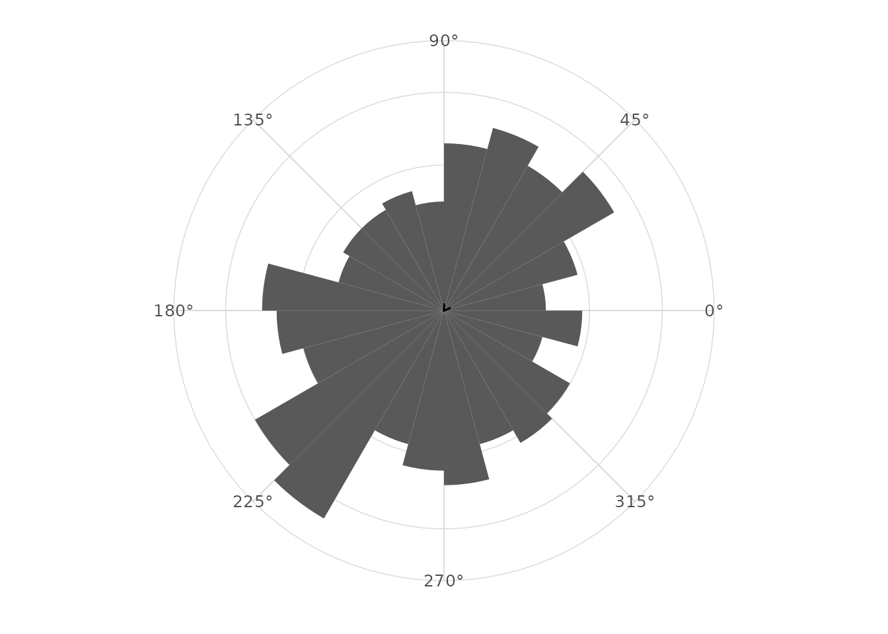
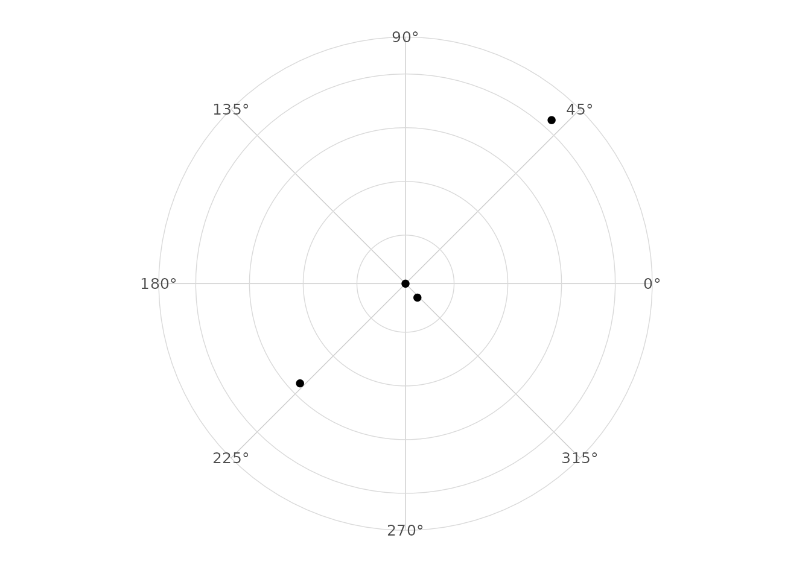

# Mean direction and uncertainty

## Circular mean

The circular mean is computed from the mean cosine and sine components.
This avoids the boundary problem that affects arithmetic means.

``` r

library(ggplot2)
library(dplyr)
#> 
#> Attaching package: 'dplyr'
#> The following objects are masked from 'package:stats':
#> 
#>     filter, lag
#> The following objects are masked from 'package:base':
#> 
#>     intersect, setdiff, setequal, union
library(ggcircular)

circular_summary(wind_directions, direction)
#> # A tibble: 1 × 7
#>       n  mean     R   Rbar variance    sd  kappa
#>   <int> <dbl> <dbl>  <dbl>    <dbl> <dbl>  <dbl>
#> 1   500  4.10  24.7 0.0494    0.951  2.45 0.0989
```

## Why arithmetic means fail

Angles close to `0` and `2 * pi` are close on the circle but far on the
real line. Component-based averages respect the circle.

## Resultant length

The mean resultant length `Rbar` is between zero and one. Values near
one indicate concentration near a common direction; values near zero
indicate weak or cancelling directionality.

## Mean by group

``` r

wind_directions |>
  group_by(season) |>
  circular_summary(direction)
#> # A tibble: 4 × 8
#>   season     n  mean     R  Rbar variance    sd kappa
#>   <chr>  <int> <dbl> <dbl> <dbl>    <dbl> <dbl> <dbl>
#> 1 fall     131 5.42  106.  0.811   0.189  0.647  3.00
#> 2 spring   115 2.36   92.3 0.802   0.198  0.664  2.89
#> 3 summer   138 3.90  120.  0.870   0.130  0.528  4.15
#> 4 winter   116 0.842 105.  0.904   0.0956 0.448  5.52
```

## Displaying the mean

``` r

ggplot(wind_directions, aes(x = direction)) +
  geom_rose(bins = 24) +
  geom_mean_direction(length = "resultant") +
  scale_x_circular_degrees() +
  coord_circular() +
  theme_circular()
```



## Arcs of uncertainty

[`stat_mean_direction()`](https://aureliennicosiaulaval.github.io/ggcircular/reference/stat_mean_direction.md)
computes approximate confidence limits when `conf.int = TRUE`.
[`geom_confidence_arc()`](https://aureliennicosiaulaval.github.io/ggcircular/reference/geom_confidence_arc.md)
can display any angular interval stored as lower and upper endpoints.

``` r

summaries <- wind_directions |>
  group_by(season) |>
  circular_summary(direction)

ggplot(summaries, aes(x = mean, y = Rbar)) +
  geom_point() +
  scale_x_circular_degrees() +
  coord_circular() +
  theme_circular()
```



## Uniform or nearly uniform cases

When `Rbar` is close to zero, the mean direction is unstable and should
be interpreted cautiously.
