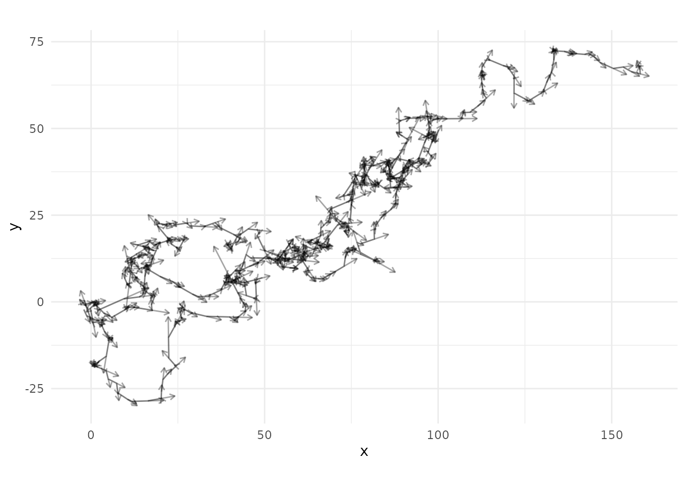
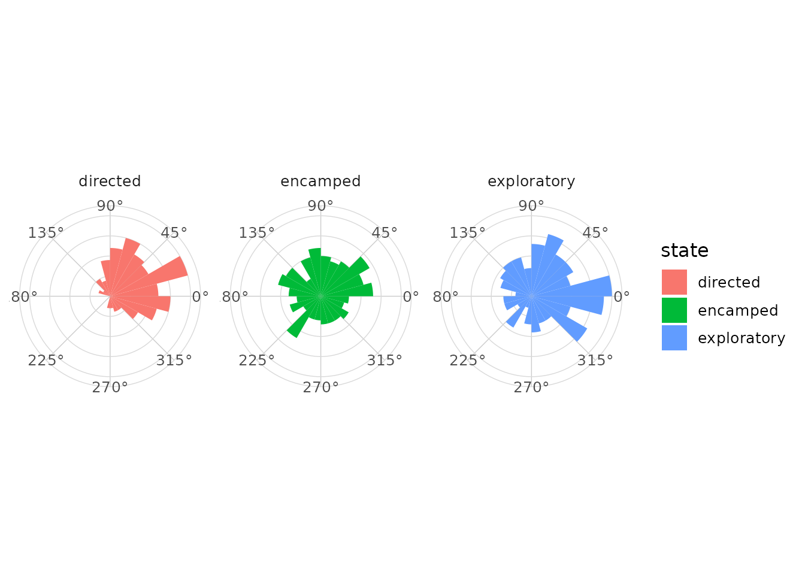
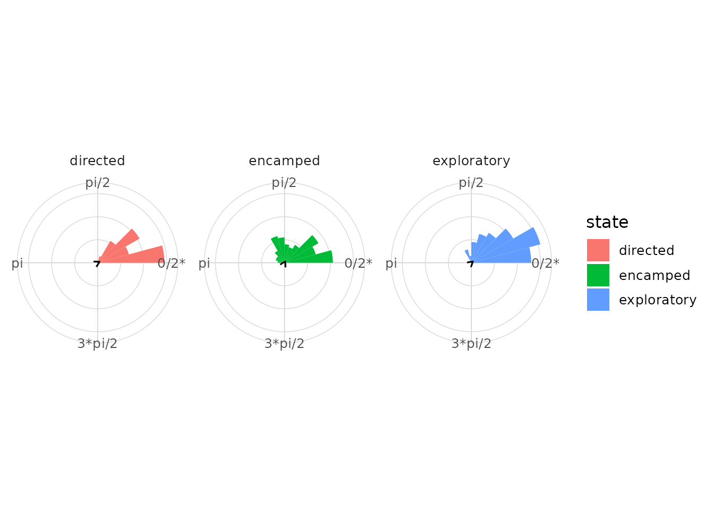

# Movement data

## Tracks and directions

Trajectories produce step lengths, bearings and turn angles. These
quantities are natural inputs for circular graphics.

``` r

library(ggplot2)
library(dplyr)
#> 
#> Attaching package: 'dplyr'
#> The following objects are masked from 'package:stats':
#> 
#>     filter, lag
#> The following objects are masked from 'package:base':
#> 
#>     intersect, setdiff, setequal, union
library(ggcircular)
```

## Coordinates, steps, bearings and turns

``` r

raw_tracks <- animal_steps |>
  select(id, time, x, y)

steps <- raw_tracks |>
  mutate_directional_features(x = x, y = y, id = id, time = time)
```

## Visualize a trajectory

``` r

ggplot(animal_steps, aes(x = x, y = y, group = id)) +
  geom_path(alpha = 0.5) +
  geom_direction_arrow(aes(angle = bearing, length = step_length), alpha = 0.35) +
  coord_equal() +
  theme_minimal()
#> Warning: Removed 3 rows containing non-finite outside the scale range
#> (`stat_direction_arrow()`).
```



## Bearings by state

``` r

ggplot(animal_steps, aes(x = bearing, fill = state)) +
  geom_rose(bins = 24) +
  facet_wrap(~ state) +
  scale_x_circular_degrees() +
  coord_circular() +
  theme_circular()
#> Warning: Removed 3 rows containing non-finite outside the scale range
#> (`stat_rose()`).
```



## Turn angles by state

``` r

ggplot(animal_steps, aes(x = turn_angle, fill = state)) +
  geom_rose(bins = 24) +
  geom_mean_direction() +
  facet_wrap(~ state) +
  scale_x_circular_radians() +
  coord_circular() +
  theme_circular()
#> Warning: Removed 280 rows containing non-finite outside the scale range
#> (`stat_rose()`).
#> Warning: Removed 280 rows containing non-finite outside the scale range
#> (`stat_mean_direction()`).
```



## Comparison by state

``` r

ggplot(animal_steps, aes(x = turn_angle, colour = state)) +
  geom_circular_density(linewidth = 1) +
  scale_x_circular_radians() +
  coord_circular() +
  theme_circular()
#> Warning: Removed 280 rows containing non-finite outside the scale range
#> (`stat_circular_density()`).
```


## Links with HMM and SSF workflows

The same summaries can be applied to observed states, hidden states or
step-selection covariates. The package intentionally keeps model
dependencies out of the core package so these workflows remain flexible.
