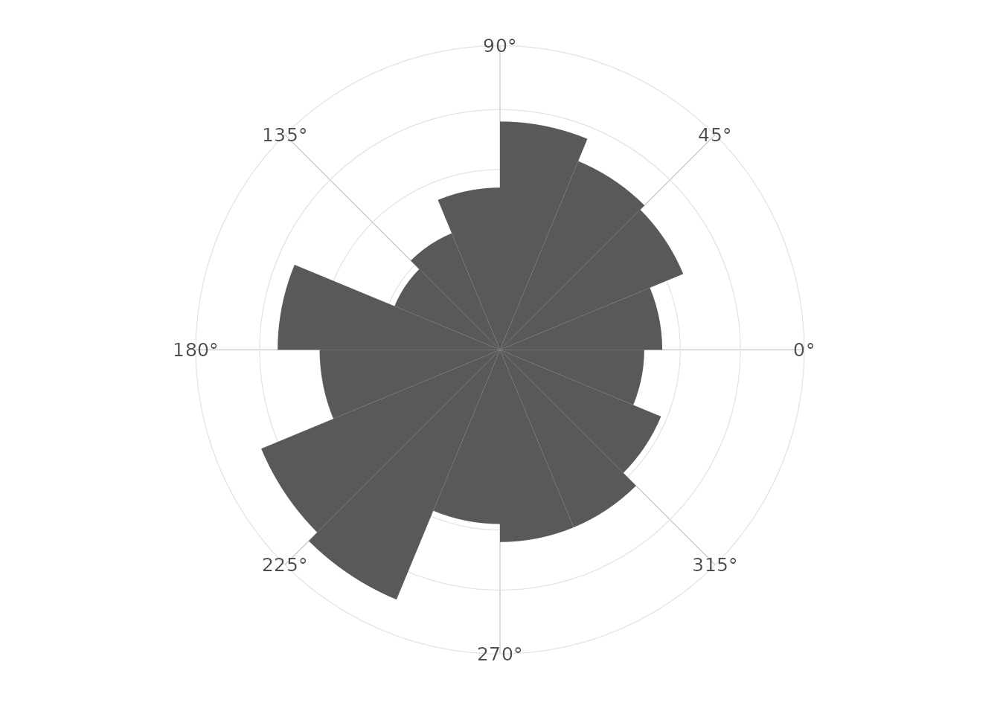
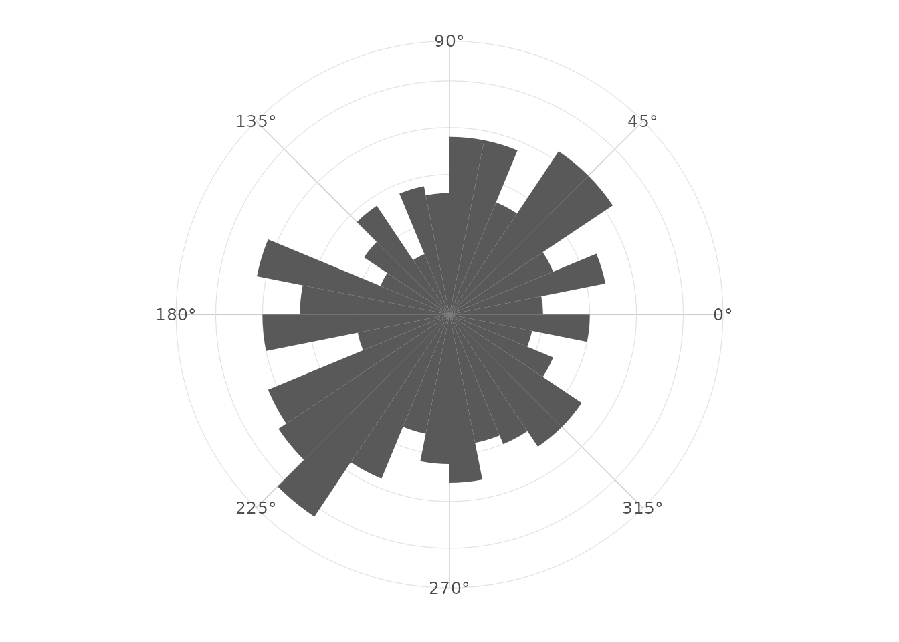
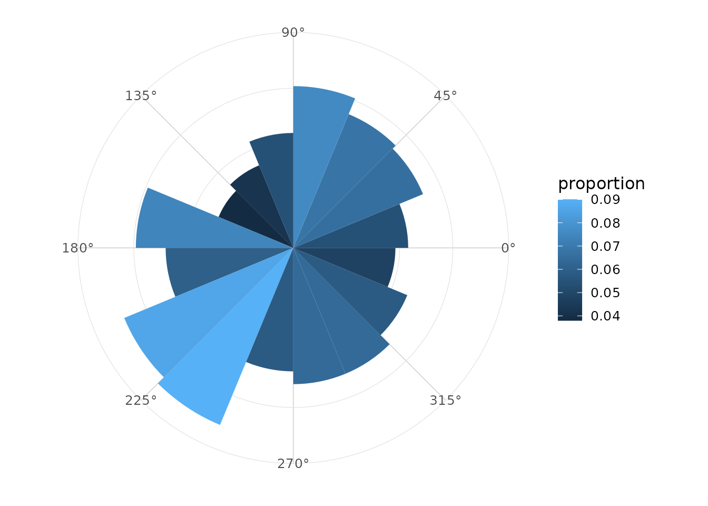
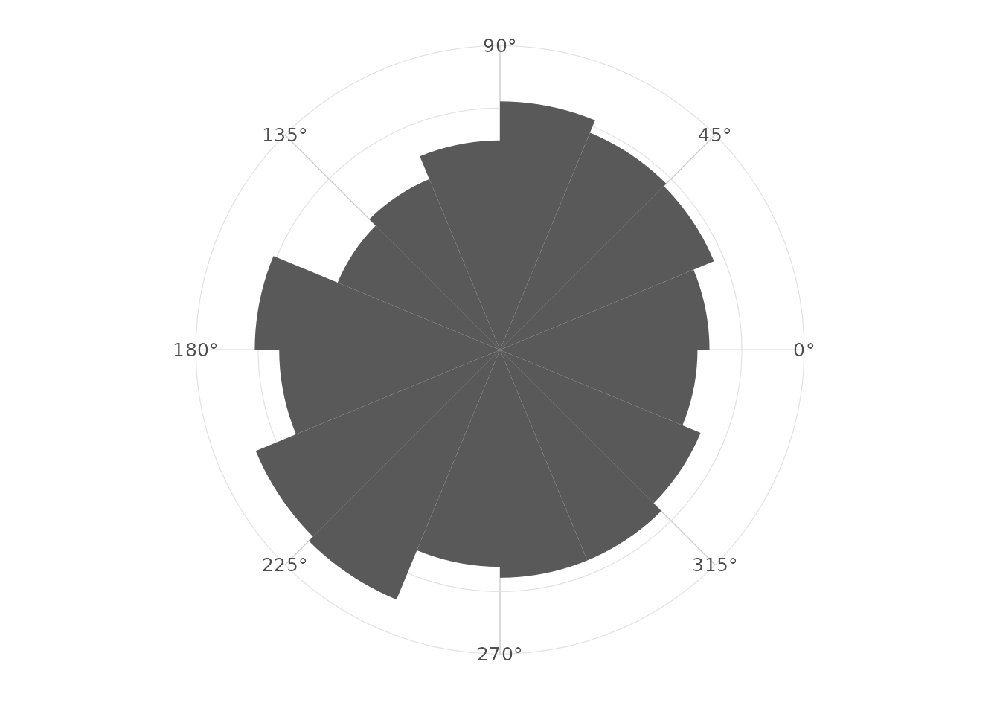
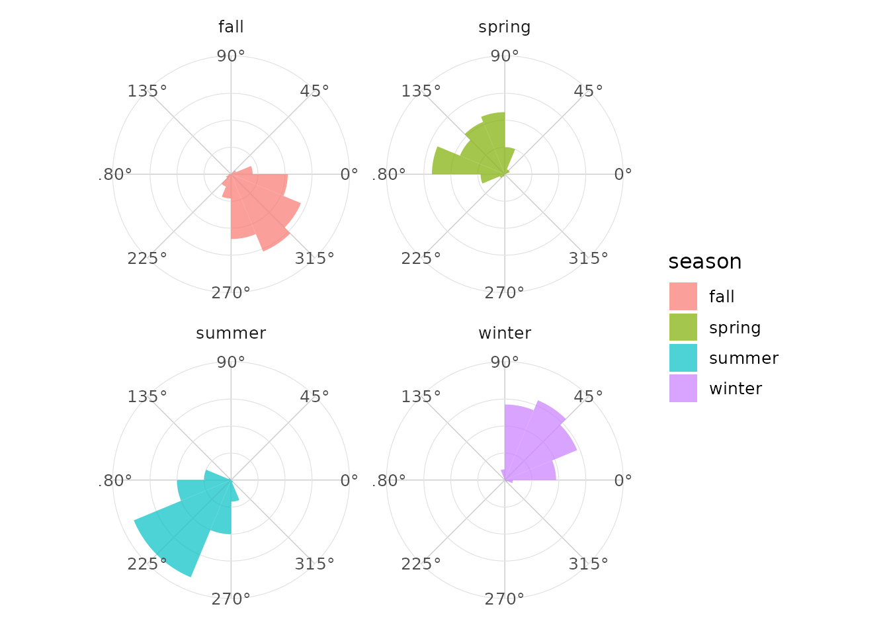
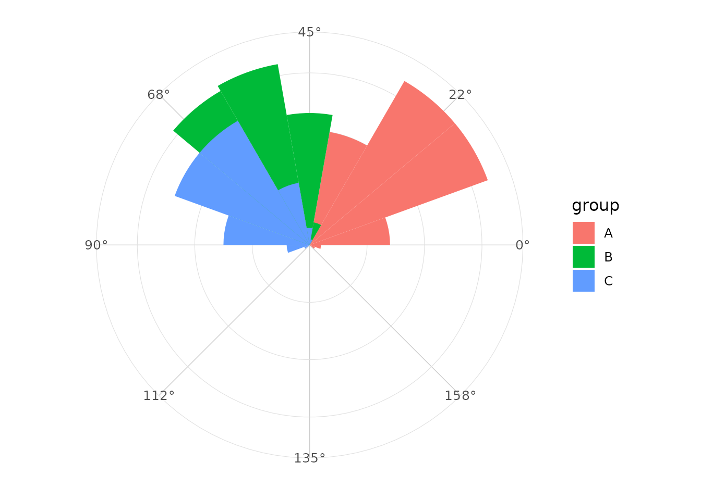

# Rose diagrams

## Definition

A rose diagram is a circular histogram. Angles are grouped into bins
around a periodic interval, and bin frequencies are displayed radially.

## Linear versus circular histograms

The discontinuity between `0` and `2 * pi` is artificial. A circular
display places these two values next to each other.

``` r

library(ggplot2)
library(ggcircular)

ggplot(wind_directions, aes(x = direction)) +
  geom_rose(bins = 16) +
  scale_x_circular_degrees() +
  coord_circular() +
  theme_rose()
```



## Choosing the number of bins

Fewer bins emphasize broad directional patterns. More bins reveal local
structure but increase sampling variability.

``` r

ggplot(wind_directions, aes(x = direction)) +
  geom_rose(bins = 32) +
  scale_x_circular_degrees() +
  coord_circular() +
  theme_rose()
```



## Counts, densities and proportions

The `normalize` argument controls the computed radial variable. The
computed variables are also available through
[`after_stat()`](https://ggplot2.tidyverse.org/reference/aes_eval.html).

``` r

ggplot(wind_directions, aes(x = direction)) +
  geom_rose(aes(fill = after_stat(proportion)), bins = 16, normalize = "proportion") +
  scale_x_circular_degrees() +
  coord_circular() +
  theme_rose()
```



## Area versus radius

When `area = TRUE`, the displayed radial height is square-root
transformed. This can help when comparing frequencies by visual area.

``` r

ggplot(wind_directions, aes(x = direction)) +
  geom_rose(bins = 16, area = TRUE) +
  scale_x_circular_degrees() +
  coord_circular() +
  theme_rose()
```



## Groups and facets

Groups can be represented with fill, colour or facets.

``` r

ggplot(wind_directions, aes(x = direction, fill = season)) +
  geom_rose(bins = 16, alpha = 0.7) +
  facet_wrap(~ season) +
  scale_x_circular_degrees() +
  coord_circular() +
  theme_rose()
```



## Axial data

For axial data, use `axial = TRUE` and a scale limit of `c(0, pi)`.

``` r

ggplot(axial_orientations, aes(x = orientation, fill = group)) +
  geom_rose(bins = 18, axial = TRUE) +
  scale_x_circular_degrees(limits = c(0, pi)) +
  coord_circular() +
  theme_rose()
```



## Interpretation

Rose diagrams are descriptive. Apparent modes can depend on the bin
origin and number of bins, so they should often be paired with a density
estimate or summary statistic.
