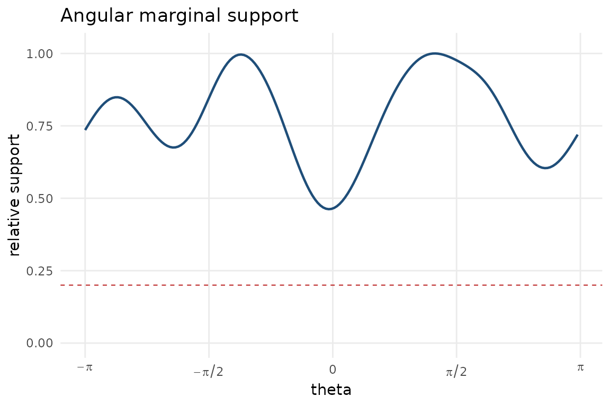

# Smoothing and support diagnostics

Conditional displays depend on smoothing parameters. This vignette shows
how to choose them by cross-validated conditional likelihood and how to
flag angular regions with weak marginal support.

``` r

library(ggcircular)

cyl <- simulate_cyl_diagnostic(n = 180, scenario = "heteroscedastic", seed = 3)
tor <- simulate_tor_diagnostic(n = 200, scenario = "doubling", seed = 4)
```

For circular-linear data, select both the circular concentration and the
linear bandwidth.

``` r

cyl_smoothing <- select_cyl_smoothing(
  theta = cyl$theta,
  x = cyl$x,
  kappa_values = c(8, 14),
  h_values = c(0.25, 0.45),
  n_folds = 3,
  seed = 5
)

head(cyl_smoothing)
#>   kappa    h mean_log_score se_log_score rank
#> 1     8 0.25      -1.023721   0.01705449    1
#> 2    14 0.25      -1.034859   0.01416652    2
#> 3     8 0.45      -1.074550   0.01315483    3
#> 4    14 0.45      -1.074584   0.01017889    4
```

For circular-circular data, select the conditioning and response
concentrations.

``` r

tor_smoothing <- select_toroidal_smoothing(
  theta = tor$theta,
  phi = tor$phi,
  kappa_theta_values = c(8, 14),
  kappa_phi_values = c(8, 14),
  n_folds = 3,
  seed = 6
)

head(tor_smoothing)
#>   kappa_theta kappa_phi mean_log_score se_log_score rank
#> 1          14        14     -0.7018435   0.03067829    1
#> 2          14         8     -0.7301233   0.02242339    2
#> 3           8        14     -0.8707599   0.03264080    3
#> 4           8         8     -0.8856081   0.02394811    4
```

The support diagnostic should be inspected before overinterpreting
conditional features in sparsely sampled angular regions.

If `R(theta)` is the kernel support relative to the best-supported
direction, the local standard error is approximately inflated by
`1 / sqrt(R(theta))` when other ingredients are fixed. Thus a threshold
of 0.25 flags regions with about twice the best-supported standard
error, while the default 0.15 permits an inflation of about 2.58. Use
0.15 for an exploratory display and 0.25 for a more conservative
reading. If the substantive interpretation changes between these
thresholds, report the sensitivity rather than selecting one value
silently.

``` r

support <- marginal_support_data(
  theta = cyl$theta,
  kappa = cyl_smoothing$kappa[1],
  relative_threshold = 0.20
)

head(support)
#>        theta  support relative_support low_support kappa relative_threshold
#> 1 0.01735687 15.50196        0.4666219       FALSE     8                0.2
#> 2 0.05207060 15.69261        0.4723607       FALSE     8                0.2
#> 3 0.08678433 15.95885        0.4803749       FALSE     8                0.2
#> 4 0.12149806 16.29675        0.4905460       FALSE     8                0.2
#> 5 0.15621179 16.70191        0.5027416       FALSE     8                0.2
#> 6 0.19092552 17.16951        0.5168168       FALSE     8                0.2
plot_marginal_support(
  theta = cyl$theta,
  kappa = cyl_smoothing$kappa[1],
  relative_threshold = 0.20
)
```



``` r

support_default <- marginal_support_data(
  theta = cyl$theta,
  kappa = cyl_smoothing$kappa[1],
  relative_threshold = 0.15
)
support_conservative <- marginal_support_data(
  theta = cyl$theta,
  kappa = cyl_smoothing$kappa[1],
  relative_threshold = 0.25
)

c(
  default_fraction_flagged = mean(support_default$low_support),
  conservative_fraction_flagged = mean(support_conservative$low_support)
)
#>      default_fraction_flagged conservative_fraction_flagged 
#>                             0                             0
```
