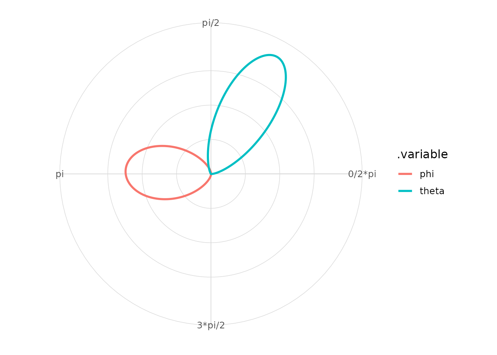
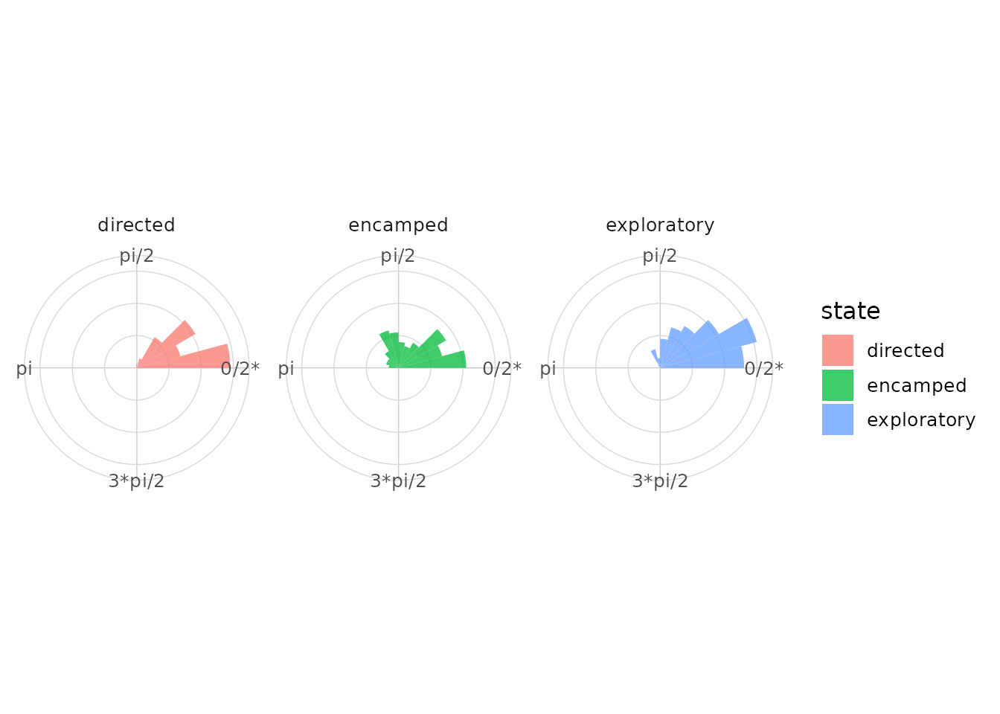

# Spherical directions and circular posterior draws

## Spherical helpers

The spherical helpers convert between azimuth-colatitude coordinates and
Cartesian unit vectors. They are intentionally lightweight and are
designed for preprocessing or summary steps.

``` r

library(ggplot2)
library(ggcircular)

coords <- spherical_to_cartesian(
  theta = c(0, pi / 2, pi),
  phi = c(pi / 2, pi / 2, pi / 3)
)

coords
#> # A tibble: 3 × 3
#>           x        y        z
#>       <dbl>    <dbl>    <dbl>
#> 1  1   e+ 0 0        6.12e-17
#> 2  6.12e-17 1   e+ 0 6.12e-17
#> 3 -8.66e- 1 1.06e-16 5   e- 1
cartesian_to_spherical(coords$x, coords$y, coords$z)
#> # A tibble: 3 × 3
#>   theta   phi radius
#>   <dbl> <dbl>  <dbl>
#> 1  0     1.57      1
#> 2  1.57  1.57      1
#> 3  3.14  1.05      1
spherical_summary(c(0, pi / 2, pi), c(pi / 2, pi / 2, pi / 3))
#> # A tibble: 1 × 8
#>       n mean_theta mean_phi     R  Rbar      x     y     z
#>   <int>      <dbl>    <dbl> <dbl> <dbl>  <dbl> <dbl> <dbl>
#> 1     3       1.44     1.11  1.13 0.375 0.0447 0.333 0.167
```

## Circular posterior draws

Posterior draws can be converted to a long circular format when the
optional `posterior` package is installed.

``` r

if (requireNamespace("posterior", quietly = TRUE)) {
  set.seed(1)
  draws <- posterior::draws_df(
    theta = rnorm(400, mean = pi / 3, sd = 0.25),
    phi = rnorm(400, mean = pi, sd = 0.35)
  )

  circular_draws <- as_circular_draws(draws, variables = c("theta", "phi"))
  summarise_circular_draws(circular_draws)
}
#> # A tibble: 2 × 7
#>   .variable     n  mean  Rbar lower upper level
#>   <chr>     <int> <dbl> <dbl> <dbl> <dbl> <dbl>
#> 1 phi         400  3.12 0.931 2.37   3.83  0.95
#> 2 theta       400  1.06 0.971 0.567  1.52  0.95
```

``` r

if (requireNamespace("posterior", quietly = TRUE)) {
  autoplot_circular_draws(circular_draws)
}
```



## State-based angle plots

The same plotting grammar applies when angles are grouped by observed or
latent states.

``` r

plot_state_angles(animal_steps, angle = turn_angle, state = state, type = "rose")
#> Warning: Removed 280 rows containing non-finite outside the scale range
#> (`stat_rose()`).
```


