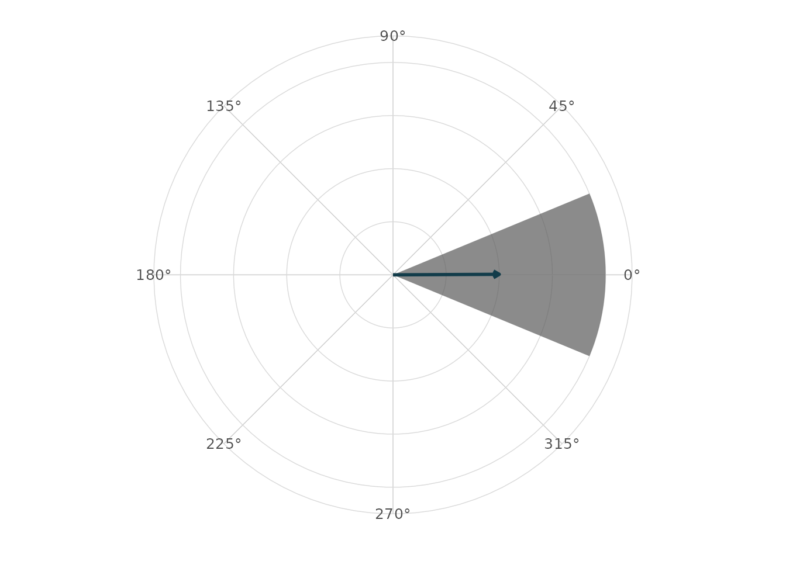
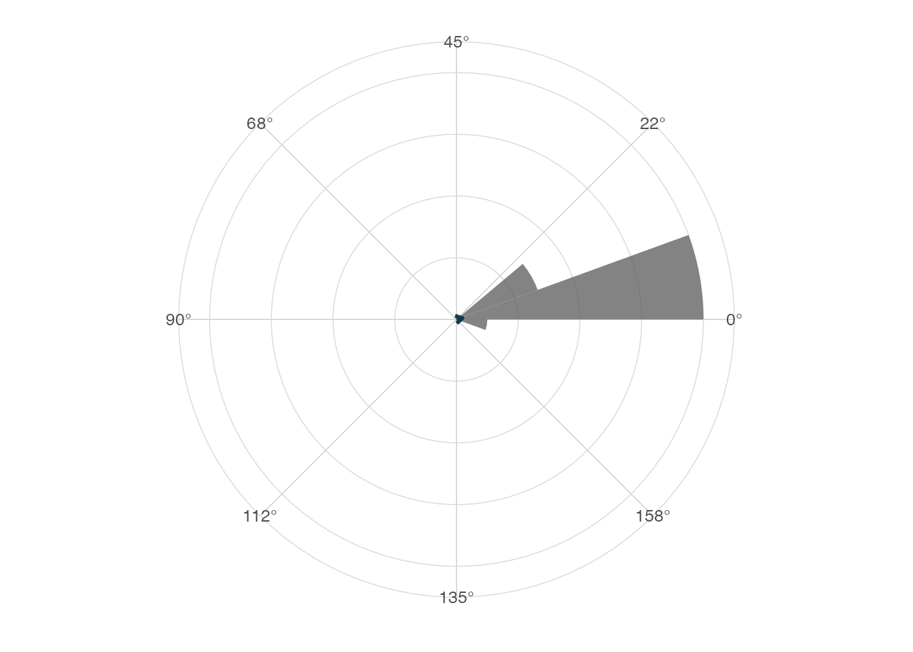
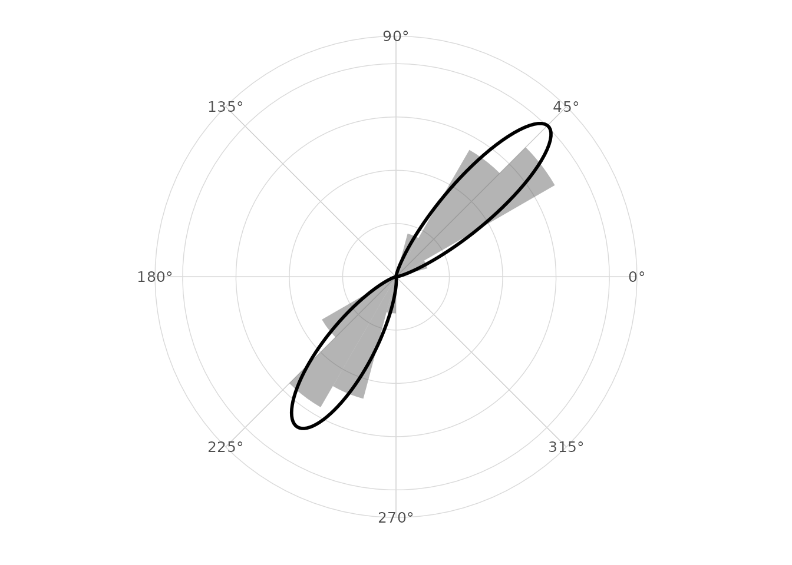

# Comparative validation notes

## Scope

This article records lightweight comparative checks for `ggcircular`. It
is a pkgdown article rather than a CRAN vignette because it may grow
into a longer validation document for a software paper.

The focus is practical agreement on core quantities:

1.  circular mean direction;
2.  mean resultant length;
3.  axial summaries;
4.  von Mises simulation and mixture diagnostics;
5.  timing and memory proxies for common plotting workflows.

``` r

library(ggplot2)
library(dplyr)
#> 
#> Attaching package: 'dplyr'
#> The following objects are masked from 'package:stats':
#> 
#>     filter, lag
#> The following objects are masked from 'package:base':
#> 
#>     intersect, setdiff, setequal, union
library(ggcircular)
```

## Optional package availability

``` r

comparison_packages <- c("circular", "CircStats", "NPCirc", "Directional")

tibble(
  package = comparison_packages,
  available = vapply(comparison_packages, requireNamespace, logical(1), quietly = TRUE)
)
#> # A tibble: 4 × 2
#>   package     available
#>   <chr>       <lgl>    
#> 1 circular    TRUE     
#> 2 CircStats   FALSE    
#> 3 NPCirc      FALSE    
#> 4 Directional FALSE
```

## Boundary behaviour

``` r

boundary <- tibble(theta = c(0.02, 0.04, 2 * pi - 0.03, 2 * pi - 0.01))

boundary |>
  summarise(
    arithmetic_mean = mean(theta),
    circular_mean = mean_direction(theta),
    Rbar = mean_resultant_length(theta)
  )
#> # A tibble: 1 × 3
#>   arithmetic_mean circular_mean  Rbar
#>             <dbl>         <dbl> <dbl>
#> 1            3.15       0.00500 1.000
```

``` r

ggplot(boundary, aes(x = theta)) +
  geom_rose(bins = 16, alpha = 0.7) +
  geom_mean_direction(colour = "#123C4A", linewidth = 1) +
  scale_x_circular_degrees() +
  coord_circular() +
  theme_circular()
```



## Comparison with circular when available

``` r

if (requireNamespace("circular", quietly = TRUE)) {
  x <- c(rnorm(120, 0.5, 0.25), rnorm(120, 5.8, 0.25))
  x <- normalize_angle(x)

  circular_x <- circular::circular(x)

  tibble(
    statistic = c("mean", "Rbar"),
    ggcircular = c(mean_direction(x), mean_resultant_length(x)),
    circular = c(
      as.numeric(circular::mean.circular(circular_x)),
      as.numeric(circular::rho.circular(circular_x))
    ),
    absolute_difference = abs(ggcircular - circular)
  )
}
#> # A tibble: 2 × 4
#>   statistic ggcircular circular absolute_difference
#>   <chr>          <dbl>    <dbl>               <dbl>
#> 1 mean          0.0196   0.0196            1.53e-16
#> 2 Rbar          0.855    0.855             0    
```

## Uniform data

``` r

uniform_angles <- seq(0, 2 * pi, length.out = 181)[-181]

tibble(
  mean = mean_direction(uniform_angles),
  Rbar = mean_resultant_length(uniform_angles),
  rayleigh_p_value = rayleigh_test(uniform_angles)$p.value
)
#> # A tibble: 1 × 3
#>    mean     Rbar rayleigh_p_value
#>   <dbl>    <dbl>            <dbl>
#> 1    NA 1.90e-17                1
```

## Axial data

``` r

axial_example <- tibble(
  orientation = normalize_angle(c(
    rnorm(60, 0.1, 0.08),
    rnorm(60, pi + 0.1, 0.08)
  ))
)

axial_example |>
  summarise(
    directional_Rbar = mean_resultant_length(orientation),
    axial_Rbar = mean_resultant_length(orientation, axial = TRUE),
    axial_mean = mean_direction(orientation, axial = TRUE)
  )
#> # A tibble: 1 × 3
#>   directional_Rbar axial_Rbar axial_mean
#>              <dbl>      <dbl>      <dbl>
#> 1          0.00536      0.986      0.112
```

``` r

ggplot(axial_example, aes(x = orientation)) +
  geom_rose(bins = 18, axial = TRUE, alpha = 0.75) +
  geom_mean_direction(axial = TRUE, colour = "#123C4A", linewidth = 1) +
  scale_x_circular_degrees(limits = c(0, pi)) +
  coord_circular() +
  theme_circular()
#> Warning: Removed 61 rows containing non-finite outside the scale range
#> (`stat_rose()`).
#> Warning: Removed 61 rows containing non-finite outside the scale range
#> (`stat_mean_direction()`).
```



## Bimodal mixture

``` r

set.seed(2026)
bimodal <- normalize_angle(c(rnorm(100, 0.8, 0.2), rnorm(100, 4.1, 0.25)))
fit <- fit_vonmises_mixture(bimodal, k = 2, nstart = 5, seed = 2026)

tidy_circular(fit)
#> # A tibble: 2 × 4
#>   component proportion    mu kappa
#>       <int>      <dbl> <dbl> <dbl>
#> 1         1      0.500 0.780  25.6
#> 2         2      0.500 4.13   18.1
glance_circular(fit)
#> # A tibble: 1 × 12
#>       n components logLik   AIC   BIC iterations converged nstart start_id
#>   <int>      <int>  <dbl> <dbl> <dbl>      <int> <lgl>      <int>    <int>
#> 1   200          2  -118.  246.  262.          4 TRUE           5        1
#> # ℹ 3 more variables: empty_components <int>, kappa_max <dbl>, axial <lgl>
```

``` r

ggplot(tibble(theta = bimodal), aes(x = theta)) +
  geom_rose(aes(y = after_stat(density)), bins = 24, alpha = 0.45) +
  stat_vonmises_mixture(fit = fit, linewidth = 1) +
  scale_x_circular_degrees() +
  coord_circular() +
  theme_circular()
```



## Timing proxy

``` r

set.seed(1)
timing_data <- normalize_angle(rnorm(1000, 1, 0.7))

system.time({
  density_tbl <- ggplot_build(
    ggplot(tibble(theta = timing_data), aes(x = theta)) +
      stat_circular_density(n = 256)
  )$data[[1]]
})
#>    user  system elapsed 
#>   0.039   0.001   0.040

density_tbl |>
  summarise(n_grid = n(), density_min = min(density), density_max = max(density))
#>   n_grid density_min density_max
#> 1    256  0.01047087   0.3970394
```

## Applied examples to keep validating

The main validation examples for an article should remain reproducible
and small:

1.  wind direction with compass bearings;
2.  animal movement turn angles by state;
3.  axial orientation data;
4.  circular residual diagnostics from angular regression;
5.  posterior angular draws when `posterior` is installed.

These examples are already represented in the package datasets and
focused articles. The next validation pass should add formal numerical
comparisons for packages that are installed in the full-suggests CI
profile.
