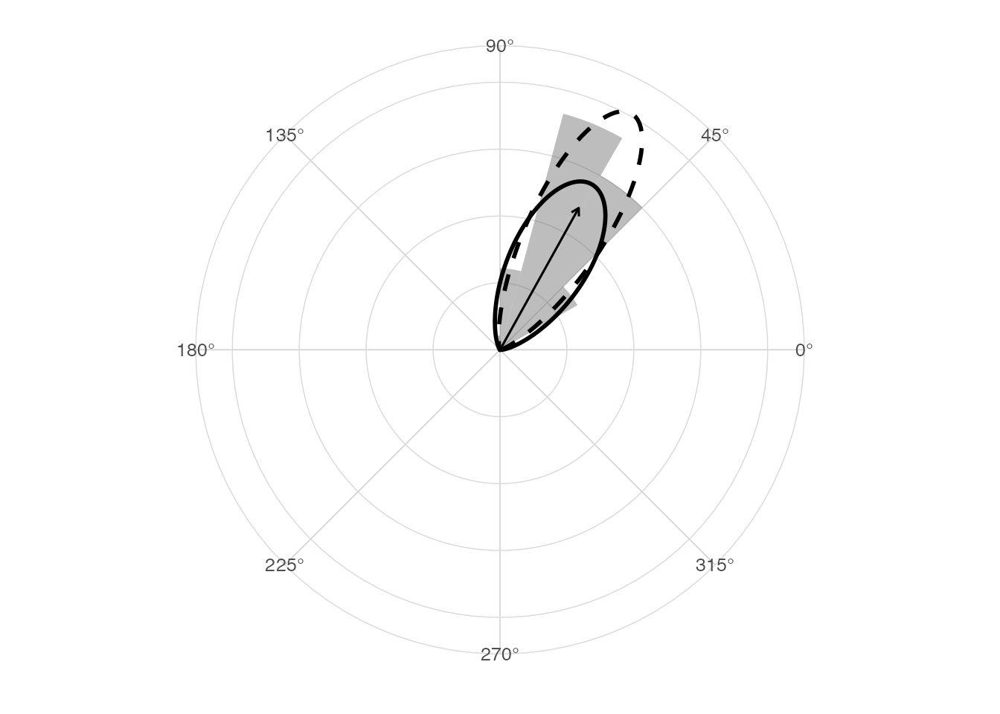
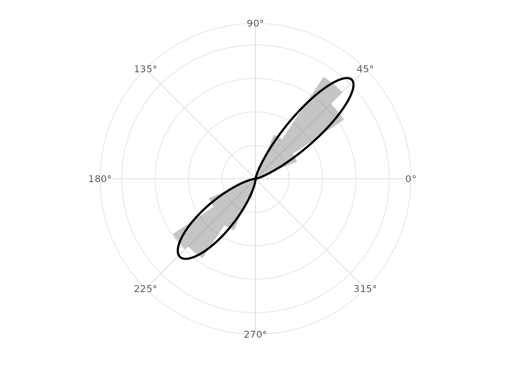

# Validation examples

## Purpose

This vignette gives reproducible validation examples for the main
numerical components in `ggcircular`. The goal is not to provide a
formal proof. The goal is to make core assumptions visible and testable.

``` r

library(ggplot2)
library(dplyr)
#> 
#> Attaching package: 'dplyr'
#> The following objects are masked from 'package:stats':
#> 
#>     filter, lag
#> The following objects are masked from 'package:base':
#> 
#>     intersect, setdiff, setequal, union
library(ggcircular)
```

## Boundary behavior

Angles close to zero and `2 * pi` should have a mean close to zero.

``` r

boundary_angles <- c(0.02, 0.05, 2 * pi - 0.05, 2 * pi - 0.02)

tibble(
  arithmetic_mean = mean(boundary_angles),
  circular_mean = mean_direction(boundary_angles),
  Rbar = mean_resultant_length(boundary_angles)
)
#> # A tibble: 1 × 3
#>   arithmetic_mean circular_mean  Rbar
#>             <dbl>         <dbl> <dbl>
#> 1            3.14             0 0.999
```

## Axial behavior

Angles separated by `pi` cancel for directional data but agree for axial
data.

``` r

theta <- c(0, pi)

tibble(
  setting = c("directional", "axial"),
  mean = c(mean_direction(theta), mean_direction(theta, axial = TRUE)),
  Rbar = c(mean_resultant_length(theta), mean_resultant_length(theta, axial = TRUE))
)
#> # A tibble: 2 × 3
#>   setting      mean     Rbar
#>   <chr>       <dbl>    <dbl>
#> 1 directional    NA 6.12e-17
#> 2 axial           0 1   e+ 0
```

## Known mean direction

The following simulation is concentrated around `pi / 3`.

``` r

set.seed(20260531)

known_mean <- pi / 3
simulated_angles <- normalize_angle(rnorm(400, mean = known_mean, sd = 0.25))

circular_summary(tibble(theta = simulated_angles), theta)
#> # A tibble: 1 × 7
#>       n  mean     R  Rbar variance    sd kappa
#>   <int> <dbl> <dbl> <dbl>    <dbl> <dbl> <dbl>
#> 1   400  1.06  388. 0.970   0.0305 0.249  16.7
angular_distance(mean_direction(simulated_angles), known_mean)
#> [1] 0.01680975
```

``` r

ggplot(tibble(theta = simulated_angles), aes(x = theta)) +
  geom_rose(aes(y = after_stat(density)), bins = 24, alpha = 0.4) +
  geom_circular_density(linewidth = 1) +
  geom_mean_direction() +
  stat_vonmises_fit(linewidth = 1, linetype = 2) +
  scale_x_circular_degrees() +
  coord_circular() +
  theme_circular()
```



## Von Mises mixture recovery

A two-component mixture should recover two separated modes in this
simple simulation.

``` r

set.seed(20260531)

mixture_angles <- c(
  normalize_angle(rnorm(250, mean = pi / 4, sd = 0.20)),
  normalize_angle(rnorm(250, mean = 5 * pi / 4, sd = 0.25))
)

mixture_fit <- fit_vonmises_mixture(mixture_angles, k = 2, max_iter = 100)

tidy_circular(mixture_fit)
#> # A tibble: 2 × 4
#>   component proportion    mu kappa
#>       <int>      <dbl> <dbl> <dbl>
#> 1         1      0.500 0.800  27.0
#> 2         2      0.500 3.94   16.8
glance_circular(mixture_fit)
#> # A tibble: 1 × 8
#>       n components logLik   AIC   BIC iterations converged axial
#>   <int>      <int>  <dbl> <dbl> <dbl>      <int> <lgl>     <lgl>
#> 1   500          2  -297.  605.  626.          4 TRUE      FALSE
```

``` r

ggplot(tibble(theta = mixture_angles), aes(x = theta)) +
  geom_rose(aes(y = after_stat(density)), bins = 32, alpha = 0.35) +
  stat_vonmises_mixture(fit = mixture_fit, linewidth = 1) +
  scale_x_circular_degrees() +
  coord_circular() +
  theme_circular()
```



## Optional comparison with circular

When the optional `circular` package is installed, the mean direction
can be compared against
[`circular::mean.circular()`](https://rdrr.io/pkg/circular/man/mean.circular.html).

``` r

if (requireNamespace("circular", quietly = TRUE)) {
  tibble(
    ggcircular = mean_direction(simulated_angles),
    circular = as.numeric(circular::mean.circular(circular::circular(simulated_angles)))
  )
}
#> # A tibble: 1 × 2
#>   ggcircular circular
#>        <dbl>    <dbl>
#> 1       1.06     1.06
```

## Interpretation

These examples are regression checks for expected behavior. They do not
cover all inferential assumptions. In particular, small-sample
inference, multimodal mixtures and model diagnostics should be
interpreted with care.
