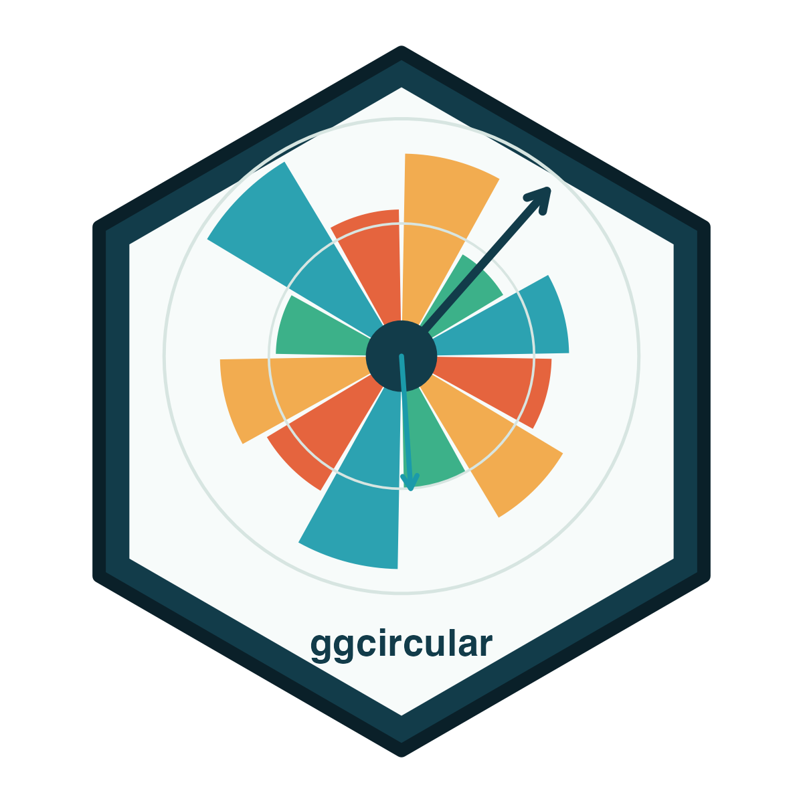
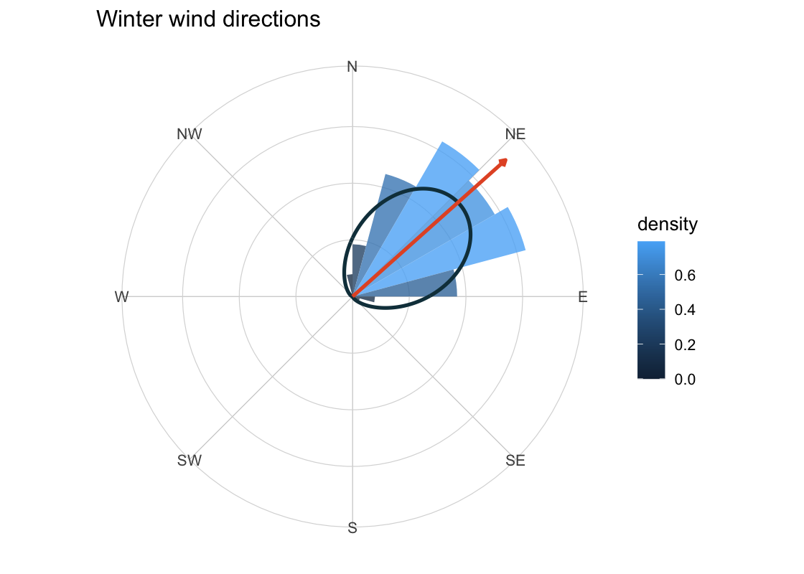
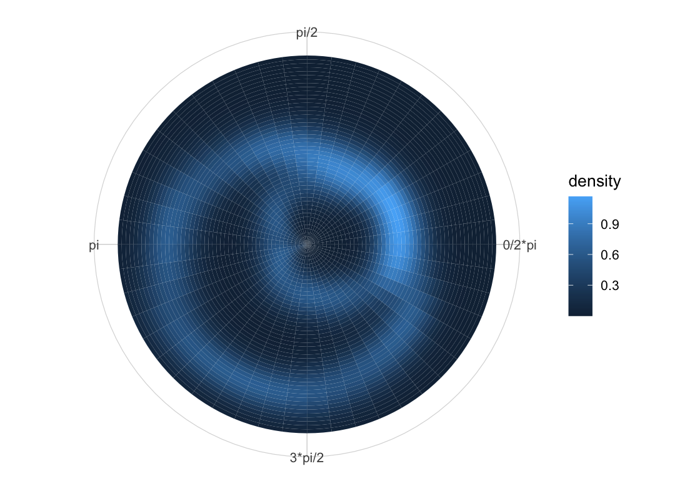
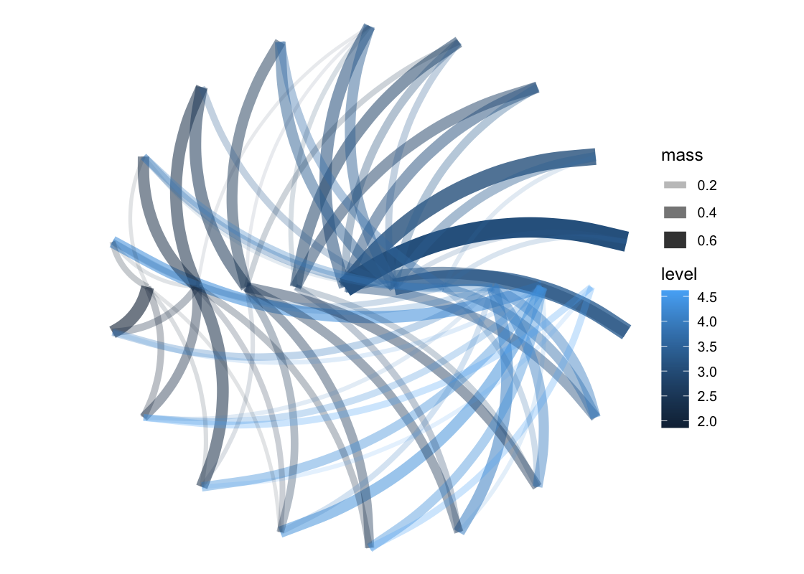
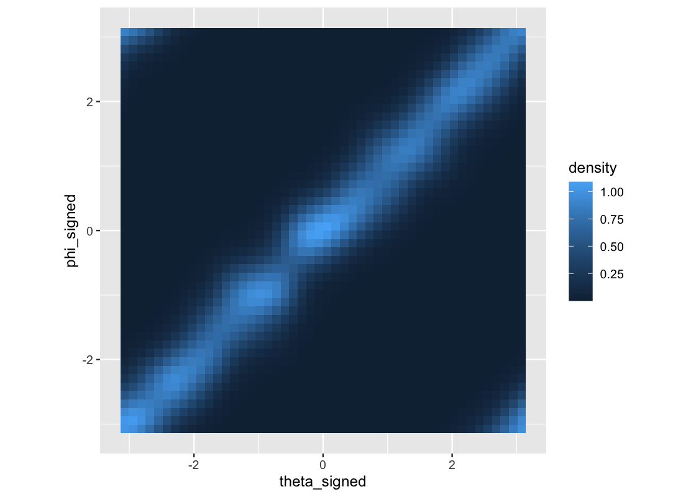
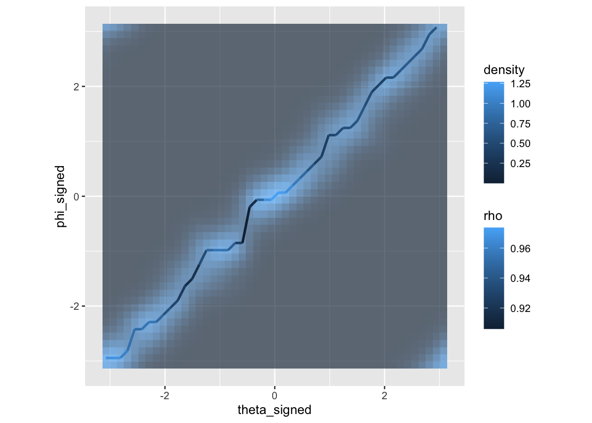
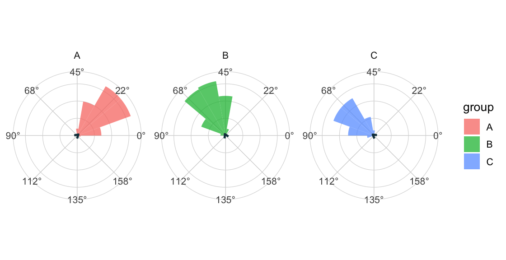
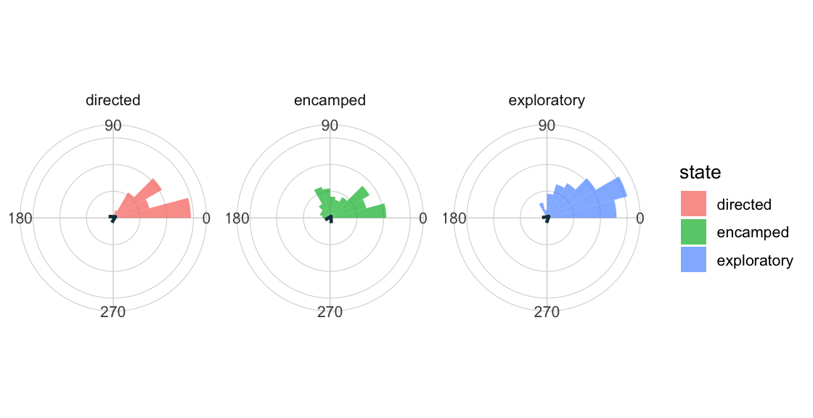
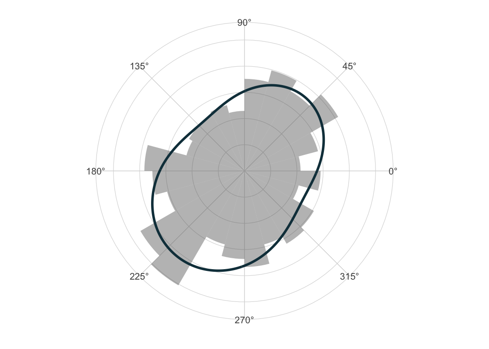

# ggcircular



[](https://github.com/AurelienNicosiaULaval/ggcircular/actions/workflows/R-CMD-check.yaml)
[](https://github.com/AurelienNicosiaULaval/ggcircular/actions/workflows/pkgdown.yaml)
[](https://CRAN.R-project.org/package=ggcircular)
[](https://lifecycle.r-lib.org/articles/stages.html#experimental)
[](https://github.com/AurelienNicosiaULaval/ggcircular/releases)
[](https://aureliennicosiaulaval.github.io/ggcircular/LICENSE)
[](https://aureliennicosiaulaval.github.io/ggcircular/DESCRIPTION)
[](https://aureliennicosiaulaval.github.io/ggcircular/)

`ggcircular` is a `ggplot2` extension for circular, axial and
directional data. It provides layers, scales, coordinate helpers,
summaries, diagnostics and displays for circular-linear and
circular-circular dependence.

The package is designed for exploratory graphics, teaching examples and
reproducible statistical workflows involving directions, bearings,
orientations, times of day, turn angles, circular-linear relationships
and other periodic measurements.

## Part of the research ecosystem

This repository is part of Aurélien Nicosia’s open research and teaching
ecosystem in computational statistics, scientific R software,
reproducible data science and statistical education.

- Research Lab:
  <https://aureliennicosiaulaval.github.io/web_site/research-lab.html>
- GitHub profile: <https://github.com/AurelienNicosiaULaval>
- Related projects:
  [`CircularRegression`](https://github.com/AurelienNicosiaULaval/CircularRegression),
  [`donnees-bleues`](https://github.com/AurelienNicosiaULaval/donnees-bleues)

## Installation

### CRAN

Install the CRAN version (currently 0.1.0):

``` r

install.packages("ggcircular")
```

### GitHub release 0.2.0

Install version 0.2.0 from GitHub:

``` r

install.packages("remotes")
remotes::install_github("AurelienNicosiaULaval/ggcircular@v0.2.0")
```

Or clone with SSH and install locally:

``` bash
git clone git@github.com:AurelienNicosiaULaval/ggcircular.git
cd ggcircular
R -q -e 'devtools::install(upgrade = "never")'
```

## Quick Start

``` r

library(ggplot2)
library(dplyr)
library(ggcircular)
```

``` r

wind_directions |>
  filter(season == "winter") |>
  ggplot(aes(x = direction)) +
  geom_rose(aes(y = after_stat(density), fill = after_stat(density)), bins = 24, alpha = 0.78) +
  geom_circular_density(linewidth = 1.1, colour = "#123C4A") +
  geom_mean_direction(length = "resultant", colour = "#E4572E", linewidth = 1.1) +
  scale_x_circular_compass() +
  coord_circular(zero = "north", direction = "clockwise") +
  labs(fill = "density", title = "Winter wind directions") +
  theme_circular()
```



## What It Does

| Workflow | Main helpers |
|----|----|
| Rose diagrams and circular histograms | [`geom_rose()`](https://aureliennicosiaulaval.github.io/ggcircular/reference/geom_rose.md), [`stat_rose()`](https://aureliennicosiaulaval.github.io/ggcircular/reference/stat_rose.md) |
| Circular density estimation | [`geom_circular_density()`](https://aureliennicosiaulaval.github.io/ggcircular/reference/geom_circular_density.md), [`stat_circular_density()`](https://aureliennicosiaulaval.github.io/ggcircular/reference/stat_circular_density.md) |
| Mean direction and concentration | [`geom_mean_direction()`](https://aureliennicosiaulaval.github.io/ggcircular/reference/geom_mean_direction.md), [`circular_summary()`](https://aureliennicosiaulaval.github.io/ggcircular/reference/circular_summary.md), [`estimate_kappa()`](https://aureliennicosiaulaval.github.io/ggcircular/reference/estimate_kappa.md) |
| Circular confidence intervals and tests | [`circular_mean_ci()`](https://aureliennicosiaulaval.github.io/ggcircular/reference/circular_mean_ci.md), [`rayleigh_test()`](https://aureliennicosiaulaval.github.io/ggcircular/reference/rayleigh_test.md), [`watson_williams_test()`](https://aureliennicosiaulaval.github.io/ggcircular/reference/watson_williams_test.md), [`stat_circular_test()`](https://aureliennicosiaulaval.github.io/ggcircular/reference/stat_circular_test.md) |
| Axial orientations modulo pi | `axial = TRUE` in summaries and layers |
| Theoretical circular distributions | [`stat_vonmises()`](https://aureliennicosiaulaval.github.io/ggcircular/reference/stat_vonmises.md), [`stat_wrapped_normal()`](https://aureliennicosiaulaval.github.io/ggcircular/reference/stat_vonmises.md), [`stat_uniform_circular()`](https://aureliennicosiaulaval.github.io/ggcircular/reference/stat_vonmises.md) |
| Mixtures of von Mises components | [`fit_vonmises_mixture()`](https://aureliennicosiaulaval.github.io/ggcircular/reference/fit_vonmises_mixture.md), [`stat_vonmises_mixture()`](https://aureliennicosiaulaval.github.io/ggcircular/reference/stat_vonmises_mixture.md) |
| Movement and state-angle graphics | [`mutate_directional_features()`](https://aureliennicosiaulaval.github.io/ggcircular/reference/mutate_directional_features.md), [`geom_direction_arrow()`](https://aureliennicosiaulaval.github.io/ggcircular/reference/geom_direction_arrow.md), [`plot_state_angles()`](https://aureliennicosiaulaval.github.io/ggcircular/reference/plot_state_angles.md) |
| Angular model diagnostics | [`circular_residuals()`](https://aureliennicosiaulaval.github.io/ggcircular/reference/circular_residuals.md), [`circular_model_diagnostics()`](https://aureliennicosiaulaval.github.io/ggcircular/reference/circular_model_diagnostics.md), [`autoplot()`](https://ggplot2.tidyverse.org/reference/autoplot.html) methods |
| Spherical and posterior helpers | [`spherical_summary()`](https://aureliennicosiaulaval.github.io/ggcircular/reference/spherical_summary.md), [`as_circular_draws()`](https://aureliennicosiaulaval.github.io/ggcircular/reference/as_circular_draws.md), [`summarise_circular_draws()`](https://aureliennicosiaulaval.github.io/ggcircular/reference/summarise_circular_draws.md) |
| Directional dependence on cylinders and tori | [`stat_circular_topography()`](https://aureliennicosiaulaval.github.io/ggcircular/reference/stat_circular_topography.md), [`geom_phase_loom()`](https://aureliennicosiaulaval.github.io/ggcircular/reference/geom_phase_loom.md), [`stat_toroidal_topography()`](https://aureliennicosiaulaval.github.io/ggcircular/reference/stat_toroidal_topography.md), [`stat_toroidal_ridge()`](https://aureliennicosiaulaval.github.io/ggcircular/reference/stat_toroidal_ridge.md) |

## Design Principles

- Angles are stored and computed in radians.
- Scales handle display labels in radians, degrees, hours or compass
  labels.
- Directional data use period `2 * pi`.
- Axial data use period `pi` through `axial = TRUE`.
- Heavy packages remain optional and are accessed with explicit
  availability checks.
- Outputs are standard `ggplot` objects, tibbles or familiar test
  objects.

## Conventions for Directions and Bearings

The default mathematical convention is `zero = "east"` with angles
increasing counterclockwise. This matches the usual unit circle.

Compass bearings use `zero = "north"` with angles increasing clockwise.
Use
[`scale_x_circular_compass()`](https://aureliennicosiaulaval.github.io/ggcircular/reference/scale_x_circular_radians.md)
together with `coord_circular(zero = "north", direction = "clockwise")`
for bearing-like data such as wind direction or movement headings.

Axial data, such as unoriented lines, are different again: `0` and `pi`
represent the same orientation. Use `axial = TRUE` in summaries and
layers for these data.

## Conditional Displays on Cylinders and Tori

All computational angles are in radians. The examples below use the
mathematical convention, with zero at east and angles increasing
counterclockwise. Smoothing controls the resolution of the conditional
estimate: larger von Mises concentration values use more local angular
neighbourhoods.

``` r

cyl <- simulate_cyl_diagnostic(n = 180, scenario = "multimodal", seed = 11)
tor <- simulate_tor_diagnostic(n = 200, scenario = "diagonal", seed = 12) |>
  mutate(
    theta_signed = angular_difference(theta, 0),
    phi_signed = angular_difference(phi, 0)
  )
```

[`stat_circular_topography()`](https://aureliennicosiaulaval.github.io/ggcircular/reference/stat_circular_topography.md)
estimates the conditional density of a real response given an angle.
[`geom_phase_loom()`](https://aureliennicosiaulaval.github.io/ggcircular/reference/geom_phase_loom.md)
instead displays binned conditional masses.

``` r

ggplot(cyl, aes(theta, x)) +
  stat_circular_topography(n_theta = 48, n_x = 48, kappa = 14) +
  coord_circular() +
  scale_x_circular_radians() +
  theme_circular()
```



``` r

ggplot(cyl, aes(theta, x)) +
  geom_phase_loom(
    n_sectors = 18,
    n_x_bins = 10,
    mass_type = "conditional",
    min_mass = 0
  ) +
  coord_equal() +
  theme_void()
```



[`stat_toroidal_topography()`](https://aureliennicosiaulaval.github.io/ggcircular/reference/stat_toroidal_topography.md)
estimates `f(phi | theta)`, while
[`stat_toroidal_ridge()`](https://aureliennicosiaulaval.github.io/ggcircular/reference/stat_toroidal_ridge.md)
extracts its first grid maximum and reports local concentration. The
ridge also computes `after_stat(ridge_ambiguous)` from near-tied
distinct local modes. A ridge is not a substitute for the full
topography when multimodality is plausible.

``` r

ggplot(tor, aes(theta_signed, phi_signed)) +
  stat_toroidal_topography(
    n_theta = 48,
    n_phi = 48,
    kappa_theta = 14,
    kappa_phi = 14,
    conditional = TRUE
  ) +
  coord_equal()
```



``` r

ggplot(tor, aes(theta_signed, phi_signed)) +
  stat_toroidal_topography(
    n_theta = 48,
    n_phi = 48,
    conditional = TRUE,
    alpha = 0.65
  ) +
  stat_toroidal_ridge(
    n_theta = 48,
    n_phi = 48,
    tie_tolerance = 0.01,
    linewidth = 1
  ) +
  coord_equal()
```



## Summaries

[`circular_summary()`](https://aureliennicosiaulaval.github.io/ggcircular/reference/circular_summary.md)
respects existing `dplyr` groups and returns mean direction, resultant
length, circular variance, circular standard deviation and an estimated
von Mises concentration parameter.
[`estimate_kappa()`](https://aureliennicosiaulaval.github.io/ggcircular/reference/estimate_kappa.md)
is a descriptive piecewise approximation from the sample resultant
length, not a full inferential fit.

``` r

wind_directions |>
  circular_summary(direction, season) |>
  mutate(
    mean_degrees = round(rad_to_deg(mean), 1),
    Rbar = round(Rbar, 3),
    kappa = round(kappa, 2)
  ) |>
  select(season, n, mean_degrees, Rbar, kappa)
#> # A tibble: 4 × 5
#>   season     n mean_degrees  Rbar kappa
#>   <chr>  <int>        <dbl> <dbl> <dbl>
#> 1 fall     131        310.  0.811  3
#> 2 spring   115        135.  0.802  2.89
#> 3 summer   138        223.  0.87   4.15
#> 4 winter   116         48.2 0.904  5.52
```

## Axial Data

Axial observations identify opposite directions. For example, an
orientation of 0 radians is equivalent to an orientation of pi radians.
Use `axial = TRUE` to compute and display these data modulo pi.

``` r

ggplot(axial_orientations, aes(x = orientation, fill = group)) +
  geom_rose(bins = 18, axial = TRUE, alpha = 0.72) +
  geom_mean_direction(axial = TRUE, colour = "#123C4A", linewidth = 1) +
  scale_x_circular_degrees(limits = c(0, pi)) +
  coord_circular() +
  facet_wrap(~ group) +
  theme_circular()
```



## Directional Movement

`ggcircular` includes helpers for bearings, turn angles and
state-specific angular distributions.

``` r

animal_steps |>
  filter(!is.na(turn_angle)) |>
  ggplot(aes(x = turn_angle, fill = state)) +
  geom_rose(bins = 24, alpha = 0.72) +
  geom_mean_direction(colour = "#123C4A", linewidth = 1) +
  scale_x_circular_degrees(
    breaks = deg_to_rad(c(0, 90, 180, 270)),
    labels = c("0", "90", "180", "270")
  ) +
  coord_circular() +
  facet_wrap(~ state) +
  theme_circular()
```



## Mixtures of von Mises Distributions

Finite mixtures are fitted with an expectation-maximization routine and
can be drawn directly on top of empirical rose diagrams. These fits are
descriptive and depend on initialization, so use `seed`, `nstart` and
diagnostic output when the mixture is substantively important.

``` r

set.seed(2026)

fit_mix <- fit_vonmises_mixture(
  wind_directions$direction,
  k = 2,
  init = "spaced",
  nstart = 3,
  seed = 2026
)

ggplot(wind_directions, aes(x = direction)) +
  geom_rose(aes(y = after_stat(density)), bins = 24, alpha = 0.42) +
  stat_vonmises_mixture(fit = fit_mix, linewidth = 1.2, colour = "#123C4A") +
  scale_x_circular_degrees() +
  coord_circular() +
  theme_circular()
```



``` r

tidy_circular(fit_mix) |>
  mutate(
    mu_degrees = round(rad_to_deg(mu), 1),
    kappa = round(kappa, 2),
    proportion = round(proportion, 3)
  ) |>
  select(component, proportion, mu_degrees, kappa)
#> # A tibble: 2 × 4
#>   component proportion mu_degrees kappa
#>       <int>      <dbl>      <dbl> <dbl>
#> 1         1      0.328       51.6  1.45
#> 2         2      0.672      232.   0.77
```

## Tests and Intervals

``` r

circular_mean_ci(
  wind_directions$direction,
  method = "bootstrap",
  R = 399,
  seed = 2026
) |>
  mutate(across(c(mean, lower, upper), rad_to_deg))
#> # A tibble: 1 × 7
#>    mean lower upper level method        n   Rbar
#>   <dbl> <dbl> <dbl> <dbl> <chr>     <int>  <dbl>
#> 1  235.  139.  354.  0.95 bootstrap   500 0.0494
```

``` r

rayleigh <- rayleigh_test(wind_directions$direction)

tibble::tibble(
  statistic = unname(rayleigh$statistic),
  n = unname(rayleigh$parameter),
  p_value = rayleigh$p.value,
  method = rayleigh$method
)
#> # A tibble: 1 × 4
#>   statistic     n p_value method
#>       <dbl> <int>   <dbl> <chr>
#> 1      1.22   500   0.295 Rayleigh test of circular uniformity
```

## Optional Model Integrations

The package keeps heavier modeling ecosystems in `Suggests`. When
available, these integrations add diagnostics without making them hard
dependencies.

``` r

fit <- CircularRegression::consensus(direction ~ speed, data = wind_directions)

circular_model_diagnostics(fit)

autoplot(fit, type = "residuals_density")
autoplot(fit, type = "fitted_observed")
```

Optional helpers currently target:

- `CircularRegression`-style angular, consensus and two-step objects
  through S3 class support.
- `momentuHMM` state probabilities and Viterbi states.
- `posterior` draw objects through
  [`posterior::as_draws_df()`](https://mc-stan.org/posterior/reference/draws_df.html).
- `circular` tests when classical circular test implementations are
  available.

## Experimental Features

The following pieces are intentionally available but still experimental:

- angular model diagnostics for optional external model classes;
- finite mixtures of von Mises distributions;
- `momentuHMM` state-angle adapters;
- spherical summaries and posterior draw helpers.

Experimental functions are documented and tested, but their return
columns may still evolve as validation reveals better public contracts.

## Statistical Limitations

`ggcircular` is primarily a visualization and diagnostics package. It
does not replace specialist inference workflows for circular statistics.

- The automatic density bandwidth is a simple heuristic.
- [`circular_mean_ci()`](https://aureliennicosiaulaval.github.io/ggcircular/reference/circular_mean_ci.md)
  is unreliable when the mean resultant length is close to zero because
  the mean direction is weakly identified.
- [`rayleigh_test()`](https://aureliennicosiaulaval.github.io/ggcircular/reference/rayleigh_test.md)
  is mainly sensitive to unimodal departures from uniformity.
- [`watson_williams_test()`](https://aureliennicosiaulaval.github.io/ggcircular/reference/watson_williams_test.md)
  relies on strong assumptions about group concentration and uses the
  optional `circular` implementation.
- Multimodal data should usually be inspected with density or mixture
  graphics, not summarized only by one mean direction.

## CRAN Status

`ggcircular` is available from CRAN at
<https://CRAN.R-project.org/package=ggcircular>. The CRAN page lists
version 0.1.0, published 2026-06-04, source archives, binaries,
vignettes and check results.

The development workflow continues to include:

- `R CMD check --as-cran` on the final source tarball;
- `--run-donttest` checks;
- hard-dependency checks with `_R_CHECK_FORCE_SUGGESTS_=false`;
- full-suggests checks when optional packages are available;
- Linux R-devel, Linux R-release, macOS R-release and Windows R-release
  checks;
- vignette build timing and source tarball size checks.

Longer articles are built for pkgdown and excluded from the CRAN
tarball.

## Vignettes

Start with:

``` r

vignette("ggcircular", package = "ggcircular")
```

Then see the pkgdown articles:

- [Getting
  started](https://aureliennicosiaulaval.github.io/ggcircular/articles/ggcircular.html)
- [Rose
  diagrams](https://aureliennicosiaulaval.github.io/ggcircular/articles/rose-diagrams.html)
- [Circular
  density](https://aureliennicosiaulaval.github.io/ggcircular/articles/circular-density.html)
- [Mean direction and
  uncertainty](https://aureliennicosiaulaval.github.io/ggcircular/articles/mean-direction-and-uncertainty.html)
- [Axial
  data](https://aureliennicosiaulaval.github.io/ggcircular/articles/axial-data.html)
- [Movement
  data](https://aureliennicosiaulaval.github.io/ggcircular/articles/movement-data.html)
- [Circular
  distributions](https://aureliennicosiaulaval.github.io/ggcircular/articles/circular-distributions.html)
- [Model
  diagnostics](https://aureliennicosiaulaval.github.io/ggcircular/articles/model-diagnostics.html)
- [Spherical and posterior
  helpers](https://aureliennicosiaulaval.github.io/ggcircular/articles/spherical-and-posterior.html)
- [Circular-linear conditional
  displays](https://aureliennicosiaulaval.github.io/ggcircular/articles/circular-linear-workflow.html)
- [Circular-circular conditional
  displays](https://aureliennicosiaulaval.github.io/ggcircular/articles/circular-circular-workflow.html)
- [Smoothing and support
  diagnostics](https://aureliennicosiaulaval.github.io/ggcircular/articles/smoothing-support-diagnostics.html)
- [Scientific validation
  notes](https://aureliennicosiaulaval.github.io/ggcircular/articles/validation.html)
- [Comparative
  validation](https://aureliennicosiaulaval.github.io/ggcircular/articles/validation-comparative.html)

## Citation

To cite `ggcircular` from R, use:

``` r

citation("ggcircular")
```

Citation metadata is also provided in `inst/CITATION`.

## Contributing and Support

Contributions are welcome through focused GitHub issues and pull
requests. See
[`CONTRIBUTING.md`](https://github.com/AurelienNicosiaULaval/ggcircular/blob/main/CONTRIBUTING.md),
[`SUPPORT.md`](https://github.com/AurelienNicosiaULaval/ggcircular/blob/main/SUPPORT.md)
and
[`CODE_OF_CONDUCT.md`](https://github.com/AurelienNicosiaULaval/ggcircular/blob/main/CODE_OF_CONDUCT.md)
for contribution, support and conduct guidelines.

## Development Status

`ggcircular` is currently experimental. The public API is usable, tested
and documented, but may still evolve as more angular model classes and
validation cases are added.

Current checks:

- Local `devtools::test()` passes.
- Local
  `devtools::check(document = FALSE, args = "--as-cran", build_args = "--no-manual")`
  is used before release commits.
- GitHub Actions runs hard-dependency checks with
  `_R_CHECK_FORCE_SUGGESTS_=false` and full-suggests checks when
  optional packages are available.
- GitHub Actions includes Linux R-devel plus Linux, macOS and Windows
  R-release.
- `pkgdown` builds and publishes the website from `main`.

## References

- Fisher, N. I. (1993). [*Statistical Analysis of Circular
  Data*](https://doi.org/10.1017/CBO9780511564345). Cambridge University
  Press.
- Jammalamadaka, S. R., and Sengupta, A. (2001). [*Topics in Circular
  Statistics*](https://doi.org/10.1142/4031). World Scientific.
- Pewsey, A., Neuhäuser, M., and Ruxton, G. D. (2013). [*Circular
  Statistics in
  R*](https://books.google.com/books/about/Circular_Statistics_in_R.html?id=qeadAAAAQBAJ).
  Oxford University Press.
- Wickham, H. (2016). [*ggplot2: Elegant Graphics for Data
  Analysis*](https://doi.org/10.1007/978-3-319-24277-4). Springer.
